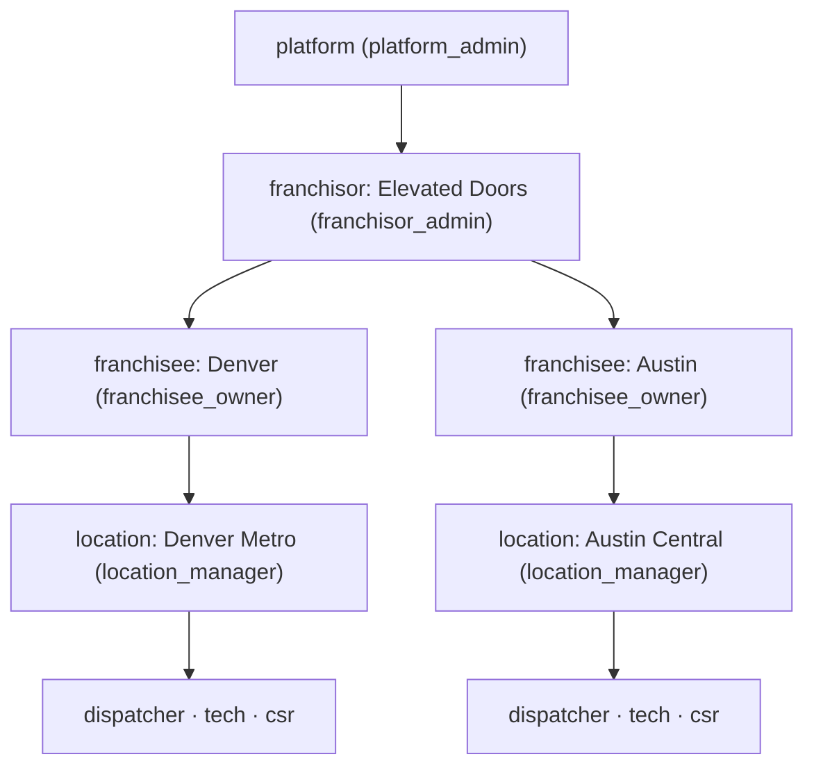
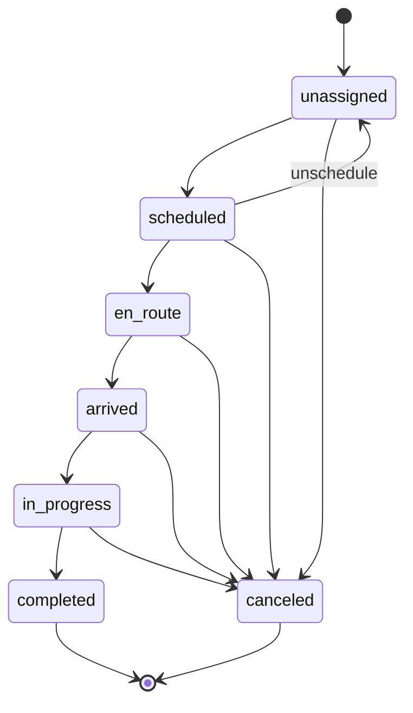

# Service.AI — Architecture

## 1. Stack

| Layer | Choice | Reason |
|---|---|---|
| Language | TypeScript (strict) | Single language across API, web, voice, mobile |
| Monorepo | pnpm workspaces + Turborepo | Fast incremental builds, shared types |
| API | Fastify 5 + Zod + tRPC-style shared contracts via ts-rest | Mature, fast, rich plugin ecosystem, shared schemas without tRPC lock-in |
| Frontend | Next.js 15 (App Router) + React 19 + Server Components | Fast, progressive rendering, matches Joey's existing muscle memory |
| UI | Tailwind + shadcn/ui | Same as OPENDC portal; franchise-brandable via CSS variables |
| Mobile | PWA (v1) → React Native v2 | Ship fast, no app stores; keep tech UI mobile-first so RN port is a shell |
| Database | Postgres 16 (DO Managed) | Franchise tenancy with row-level scoping, proven at this scale |
| ORM | Drizzle | Type-safe, migrations in SQL, no magic |
| Cache / queue | Redis 7 (DO Managed) + BullMQ | Job queue for AI tasks, collections, royalty calculations |
| Voice | Fastify WS server + Twilio Media Streams + Deepgram (streaming ASR) + ElevenLabs (TTS) | Greenfield but same providers as Donna PA |
| AI router | Custom thin layer over Anthropic SDK + xAI SDK (OpenAI-compat) | Per-capability routing; swap-friendly |
| AI reasoning | Claude (Opus 4.7 default, Sonnet 4.6 for bulk) | Tool-use strength, instruction-following |
| AI bulk / web-context | Grok (via xAI API) | Cost-efficient summarization, real-time X/web lookups if ever needed |
| Vision | Claude Sonnet 4.6 vision | Photo-to-quote, door identification |
| Vector store | Postgres + pgvector | One fewer service; works for v1 scale |
| Auth | Better Auth (self-hosted) | Schema-owned, plays with Drizzle, handles 4-level hierarchy |
| Payments | Stripe Connect Standard | Franchisee owns merchant relationship; application_fee_amount = royalty |
| SMS / Voice infra | Twilio | Provisioned numbers per franchisee, Media Streams for voice WS |
| Maps | Google Maps (Places API + Geocoding + Distance Matrix) | Address autocomplete mid-call is the killer feature |
| Storage | DO Spaces (S3-compatible) | Photos, call recordings |
| Email | Resend | Transactional + collections |
| Observability | Axiom (logs) + Sentry (errors) + OpenTelemetry | Low ops, good signal-to-noise |
| CI/CD | GitHub Actions → DO App Platform auto-deploy on push to main | Matches OPENDC pattern |
| Testing | Vitest (unit + integration) + Playwright (E2E) + k6 (perf) | Fast, TS-native |

## 2. Service topology

Three deployable services (one repo, one shared package):

```
servicetitan-clone/
├── apps/
│   ├── web/          Next.js 15 — office UI, dispatch board, franchisor console
│   ├── api/          Fastify API — business logic, auth, Stripe, jobs, AI orchestration
│   └── voice/        Fastify WS — Twilio Media Streams + Deepgram + ElevenLabs
├── packages/
│   ├── db/           Drizzle schema + migrations
│   ├── contracts/    Zod schemas + ts-rest route definitions shared by api + web
│   ├── ai/           Multi-provider LLM router, prompt library, RAG client
│   ├── auth/         Better Auth config + middleware
│   └── ui/           shadcn component library
└── tools/            scripts, seeds, migrations tooling
```

Web talks to API only via the ts-rest contracts in `packages/contracts`. Voice talks to API for business actions (create job, update status). No direct DB access from web or voice — API is the only writer.

## 2a. Package dependency graph

Explicit directed dependency edges (→ = "depends on"). Only workspace packages shown; external npm dependencies omitted.

```
apps/web    → packages/contracts   (shared Zod schemas + ts-rest client)
apps/web    → packages/ui          (shadcn component library)
apps/web    → packages/auth        (session/cookie helpers)

apps/api    → packages/contracts   (shared Zod schemas + ts-rest server handler)
apps/api    → packages/db          (Drizzle ORM schema + Pool client)
apps/api    → packages/ai          (LLM router, prompt library)
apps/api    → packages/auth        (Better Auth middleware)

apps/voice  → packages/ai          (LLM router for voice-to-text intent extraction)
apps/voice  → packages/auth        (session validation for WS upgrades)

packages/ai → (no workspace deps — only external: anthropic, @ai-sdk/xai, zod)
packages/db → (no workspace deps — only external: drizzle-orm, pg)
packages/contracts → (no workspace deps — only external: @ts-rest/core, zod)
packages/auth → packages/db        (reads/writes session + membership tables)
packages/ui → (no workspace deps — only external: react, tailwindcss, radix-ui)
```

**Forbidden edges (enforced by CLAUDE.md):**
- `apps/web` → `packages/db` — web must not touch DB directly; all writes go through `apps/api`
- `apps/voice` → `packages/db` — same rule
- Any package → direct LLM SDK import — all LLM calls route through `packages/ai`

## 2b. Local vs. DO environment parity

| Concern | Local (Docker Compose) | DO App Platform |
|---|---|---|
| Postgres | `postgres:16-alpine` container, port 5434 on host | DO Managed Postgres 16 |
| Redis | `redis:7-alpine` container, port 6381 on host | DO Managed Redis 7 |
| Secret injection | `.env` file (gitignored) → Docker `environment:` | DO App Platform env vars (encrypted at rest) |
| Connectivity | Services reach each other by Docker service name (`postgres:5432`, `redis:6379`) | Same DNS pattern via DO's internal VPC |
| Ports | web:3000, api:3001, voice:8080 (mapped to host) | Each service on its own DO App subdomain; internal routing via DO network |
| Build | `pnpm dev` with tsx watch (hot reload) | `pnpm build` → static artifact; auto-deploy on push to `main` |
| Observability | Axiom + Sentry disabled when env vars absent (local default) | Tokens injected via DO env → Axiom dataset + Sentry DSN active |

The `DATABASE_URL` and `REDIS_URL` env var names are identical in both environments, ensuring zero code-path differences between local and deployed.

## 3. Data model (key tables)

### Tenancy & auth
- `franchisors(id, name, brand_config, created_at)`
- `franchisees(id, franchisor_id, legal_name, stripe_account_id, twilio_number, created_at)`
- `locations(id, franchisee_id, name, territory_zipcodes[], timezone, created_at)`
- `users(id, email, name, phone, created_at)` — global identity
- `memberships(id, user_id, scope_type, scope_id, role, created_at)` — scope_type ∈ (platform, franchisor, franchisee, location); one user can have memberships at multiple scopes
- `sessions`, `accounts`, `verifications` — Better Auth tables
- `audit_log(id, actor_user_id, actor_scope, target_table, target_id, action, franchisor_id, franchisee_id, metadata, created_at)` — every franchisor cross-tenant read captured

### Core (trade-agnostic)
- `customers(id, franchisee_id, location_id, name, phone, email, address, lat, lng, notes, created_at)`
- `jobs(id, franchisee_id, location_id, customer_id, tech_user_id, status, scheduled_at, arrived_at, completed_at, summary, metadata_jsonb, created_at)`
- `job_status_log(id, job_id, from_status, to_status, actor, at)` — state machine history
- `job_photos(id, job_id, url, kind, taken_at)` — kind ∈ (arrival, during, completion)

### Pricebook
- `service_catalog_templates(id, franchisor_id, name, published_at)` — HQ-blessed
- `service_items(id, template_id, franchisee_id, sku, name, description, category, base_price, floor_price, ceiling_price, trade)` — template_id set = HQ item; franchisee_id set = local override
- `pricebook_overrides(id, franchisee_id, service_item_id, price, active)` — explicit overrides for published templates

### Invoicing & payments
- `invoices(id, franchisee_id, job_id, customer_id, subtotal, tax, total, status, stripe_payment_intent_id, created_at)`
- `invoice_line_items(id, invoice_id, service_item_id, description, qty, unit_price, total)`
- `payments(id, invoice_id, stripe_payment_intent_id, amount, application_fee_amount, status, paid_at)`
- `refunds(id, payment_id, stripe_refund_id, amount, reason, created_at)`

### Royalty
- `franchise_agreements(id, franchisor_id, franchisee_id, signed_at, effective_at, terminated_at, terms_jsonb)`
- `royalty_rules(id, agreement_id, rule_type, config_jsonb, active)` — rule_type ∈ (percentage, flat_per_job, tiered, minimum_floor)
- `royalty_statements(id, franchisee_id, period_start, period_end, revenue, royalty_owed, adjustments, transferred_at, stripe_transfer_id, status)`

### AI
- `ai_conversations(id, kind, franchisee_id, initiator_user_id, metadata_jsonb, started_at, ended_at)` — kind ∈ (voice_csr, dispatcher_suggestion, tech_assist, collections_draft)
- `ai_messages(id, conversation_id, role, content, tool_calls_jsonb, provider, model, tokens_in, tokens_out, created_at)`
- `ai_actions(id, conversation_id, action_type, target_table, target_id, status, confidence, human_reviewed_by, reviewed_at)` — status ∈ (pending, auto_approved, human_approved, rejected, reverted)
- `kb_docs(id, franchisor_id, source_kind, title, content, embedding vector(1536), metadata_jsonb)` — pgvector; source_kind ∈ (manual, brand_manual, install_guide, franchisee_note)

### Voice & telephony
- `phone_numbers(id, franchisee_id, twilio_sid, e164, provisioned_at, active)`
- `call_sessions(id, franchisee_id, phone_number_id, from_e164, to_e164, direction, ai_conversation_id, recording_url, duration_sec, outcome, started_at, ended_at)`

## 4. API contract style

- **REST + OpenAPI**, generated from ts-rest route definitions in `packages/contracts`.
- All endpoints namespaced `/api/v1/...`. Every endpoint returns `{ ok: true, data }` or `{ ok: false, error: { code, message, details? } }`.
- Auth: `Authorization: Bearer <session_token>` (Better Auth). Franchisor impersonation via `X-Impersonate-Franchisee: <id>` header, validated and audit-logged.
- Pagination: cursor-based, `limit` + `cursor`, response includes `nextCursor`.
- Idempotency: every POST accepts `Idempotency-Key` header; enforced via Redis 24h TTL.
- Rate limits: per-user per-endpoint via Fastify rate-limit plugin + Redis.

## 5. Auth & RBAC

Better Auth manages sessions. Authorization is a Fastify plugin
(`apps/api/src/request-scope.ts`) that resolves the effective scope from
the `memberships` table + any impersonation header or cookie.

### Roles (enum, strictest first)
- `platform_admin` — scope=platform
- `franchisor_admin` — scope=franchisor
- `franchisee_owner` — scope=franchisee
- `location_manager` — scope=location
- `dispatcher`, `tech`, `csr` — scope=franchisee/location

### Tenancy hierarchy



Every membership row lives in one box above. `RequestScope` (below) is a
discriminated-union view of which box the caller currently stands in.

### Request context (RequestScope)

On every authenticated request, `requestScopePlugin` attaches:

- `request.userId` — Better Auth session user id, or null for anonymous
- `request.scope` — one of:
  - `{ type: 'platform', userId, role: 'platform_admin' }`
  - `{ type: 'franchisor', userId, role: 'franchisor_admin', franchisorId }`
  - `{ type: 'franchisee', userId, role, franchisorId, franchiseeId, locationId? }`
- `request.impersonation` — non-null when `X-Impersonate-Franchisee`
  (header) or `serviceai.impersonate` (cookie) is validated. Carries
  `{ actorUserId, actorFranchisorId, targetFranchiseeId, targetFranchiseeName? }`
- `request.requireScope()` — throws 401/403 with a structured error code
  when the caller is unauthenticated or has no active membership

The scope is consumed by `withScope(db, scope, fn)` from `@service-ai/db`,
which opens a transaction, sets three session GUCs
(`app.role`, `app.franchisor_id`, `app.franchisee_id`) via
`set_config(..., true)` so they auto-clear at commit/rollback, then
runs the callback inside. Postgres RLS policies (migration 0003) read
those GUCs and filter rows.

### Impersonation

`franchisor_admin` users can temporarily narrow their scope to a single
franchisee they own. Two entry points map to the same validation path:

1. **API clients**: send `X-Impersonate-Franchisee: <uuid>` header.
2. **Web UI**: POST `/impersonate/start` — sets the `serviceai.impersonate`
   httpOnly cookie (same-origin via Next.js rewrites, no header
   injection needed on client fetches). The HQ banner renders on every
   protected route while the cookie is present.

On successful validation the scope narrows to `{ type: 'franchisee', role: 'franchisee_owner', franchiseeId: <target> }`
so RLS policies match the target franchisee with full permissions; the
actor's original role is preserved on `request.impersonation` for
audit. Every validated impersonated request writes exactly one
`audit_log` row (`action='impersonate.request'`).

## 6. Multi-tenancy (rows, not schemas)

Single database, single schema, row-level scoping enforced in two layers:

1. **Application layer** — every tenant-scoped endpoint reads
   `request.scope`, composes a WHERE clause against it (e.g.
   `franchisees.franchisor_id = scope.franchisorId`), and runs the
   query inside `withScope()`.
2. **Postgres RLS (defence in depth)** — every tenant-scoped table has
   `ROW LEVEL SECURITY ENABLED` + `FORCE ROW LEVEL SECURITY` plus three
   policies per table (platform bypass, franchisor by franchisor_id,
   franchisee by franchisee_id). Policies read the GUCs set by
   `withScope` so a bug that forgets the WHERE clause still fail-closes.

Why one DB + row-level rather than a schema or database per franchisee:

- Cross-franchise analytics for franchisors is first-class — schemas
  would make that painful
- One fewer ops dimension (no N schemas to migrate)
- RLS is the defence-in-depth net if the app forgets a filter

**Production note:** RLS only fires when the DB role is non-superuser.
DO Managed Postgres provides a non-superuser app role by default. The
dev docker-compose Postgres creates a superuser (`builder`), so RLS is
bypassed there; the app-layer WHERE clauses are the primary check on
that connection. Tests that need to verify RLS directly use a
`rls_test_user` role created at test setup — see
`packages/db/src/__tests__/live-rls.test.ts`.

## 6a. Customer / job model (phase_customer_job)

The trade-agnostic backbone every later phase reads from. Four tables,
all tenant-scoped with the same three-policy RLS pattern as migration
0003:

| Table            | Purpose                                                 |
|------------------|---------------------------------------------------------|
| `customers`      | End customers. Soft-deleted. Address fields denormalised from Google Places (kept alongside `place_id` so we can re-fetch the canonical record). |
| `jobs`           | Customer-bound work items. `status` column carries the current state; `scheduled_*` vs `actual_*` timestamps track lifecycle. |
| `job_status_log` | Append-only transition history. Denormalised `franchisee_id` so RLS matches with a single-column predicate. |
| `job_photos`     | Photo metadata only. Bytes live in DO Spaces; storage cleanup on delete is deferred to v2 (`docs/TECH_DEBT.md`). |

### Job status state machine



Transitions are enforced in the API layer by `canTransition(from, to)`
in `apps/api/src/job-status-machine.ts`, not by a DB CHECK constraint.
The API writes the status update and `job_status_log` row in a single
transaction so status and log never drift. The web UI reads the same
matrix (`validTransitionsFrom`) to render only the buttons that
represent legal next steps.

### Photo upload flow

Browser-direct upload to DO Spaces, so large photos never transit the
API. Three steps:

1. `POST /api/v1/jobs/:id/photos/upload-url` → API returns a short-lived
   (15-minute) presigned PUT URL plus the `storageKey` the client must
   send back on finalise. Key format:
   `jobs/<jobId>/photos/<uuid>.<ext>`
2. Browser `PUT`s the file bytes directly to `uploadUrl`
3. `POST /api/v1/jobs/:id/photos` with `{ storageKey, contentType,
   sizeBytes }` → API writes a `job_photos` row inside `withScope()`
   and returns the row plus a fresh download URL.

The API validates that `storageKey` starts with `jobs/<jobId>/photos/`
to prevent a caller from claiming an object in another job's
namespace.

### External-service adapters

Two pluggable-adapter pairs keep tests network-free:

- `PlacesClient` (`apps/api/src/places.ts`) — `stubPlacesClient` for
  dev + tests, `googlePlacesClient(GOOGLE_MAPS_API_KEY)` for prod.
- `ObjectStore` (`apps/api/src/object-store.ts`) — `stubObjectStore()`
  for dev + tests, `s3ObjectStore(cfg)` wrapping
  `@aws-sdk/s3-request-presigner` for prod DO Spaces.

Both wire through `buildApp` options; absence of the env var just
uses the stub with a WARN log (no crash).

## 6b. Pricebook model (phase_pricebook)

Franchisor-authored catalog → per-franchisee inherited pricebook with
floor/ceiling overrides.

| Table                       | Owner      | Purpose                                                   |
|-----------------------------|------------|-----------------------------------------------------------|
| `service_catalog_templates` | franchisor | Versioned draft/published/archived template. Invariant: at most one `published` per franchisor; publishing a new one atomically archives the previous. |
| `service_items`             | franchisor | Line items with `base_price`, nullable `floor_price` + `ceiling_price`, category, unit, sku. Read-only to franchisee-scoped users via the `scoped_read` RLS policy. |
| `pricebook_overrides`       | franchisee | One active override per `(franchisee_id, service_item_id)`. Soft-deleted; revert restores base price. |

### Resolved pricebook

`GET /api/v1/pricebook` merges the franchisor's published template's
items with the caller's overrides:

```
effectivePrice = override_price (if active) else base_price
overridden     = override_price IS NOT NULL
```

Items in `draft` or `archived` templates never appear. This is the
shape every later phase (quotes, invoices, royalty engine) reads
from — there's no other price source.

### Floor / ceiling invariant

```
floor_price ≤ override_price ≤ ceiling_price    (when each bound is set)
```

Violations return `400 PRICE_OUT_OF_BOUNDS` with the boundary value
in the message so the UI can render an inline hint before the user
hits send. Server-side is the authority; client-side validation is
pure UX.

### Read-only scoped RLS policy (reusable pattern)

Migration 0006 introduces a new RLS policy shape — `FOR SELECT` only,
scoped by `app.franchisor_id`. Franchisee-scoped users can read their
franchisor's templates + items without any ability to mutate them.
Writes still go through the `platform_admin` / `franchisor_admin`
policies. This is the template any future "franchisor-authored shared
data" (knowledge base, training materials, brand assets) should
follow — see `packages/db/migrations/0006_pricebook.sql` for the
canonical three-policy-plus-one pattern.

## 6c. Dispatch + realtime (phase_dispatch_board)

Phase 5 adds the dispatch board + live propagation of assignment
and status changes across every open session within a franchisee.

### EventBus

`apps/api/src/event-bus.ts` defines a minimal `EventBus` interface
with publish / subscribe semantics plus a default in-process impl
based on Node's `EventEmitter`. Events carry **ids only** — never
job titles, customer names, or prices — so receivers that shouldn't
see those fields can't snoop via the stream; clients re-fetch
through `/api/v1/jobs/:id` which is scope-filtered.

For multi-host deployments, swap the default for a Redis pub/sub
adapter with the same interface. Pattern matches `PlacesClient` and
`ObjectStore` from earlier phases.

### Server-Sent Events

`GET /api/v1/jobs/events/stream` returns `text/event-stream` with
one SSE frame per matching event. Subscribers pass through the
`requestScopePlugin`, so the server computes a scope-filter
predicate on connect and hands it to `EventBus.subscribe`.

- Franchisee-scoped → only events in their franchisee
- Franchisor-admin → events in any of their franchisees (resolved
  once at connect-time from `franchisees` table)
- Platform admin → everything

15-second comment heartbeat so proxies keep idle sockets open.
Cleanup is registered on both the request's `close` and `error`
events so subscribers don't leak when the browser walks away.

### Assignment endpoint

`POST /api/v1/jobs/:id/assign` validates the target tech is an
active `tech` membership in the job's franchisee (cross-franchisee
or non-tech → `400 INVALID_TARGET`). If the job was `unassigned`
the handler atomically transitions it to `scheduled` and writes a
`job_status_log` row in the same transaction — status + history
never drift. Publishes `job.assigned` (+ `job.transitioned` when
the side-effect fires) on the EventBus.

`POST /api/v1/jobs/:id/unassign` clears the assignment and, when
the job was `scheduled` with no explicit times, reverts the status
to `unassigned` with another `job_status_log` entry.

### Conflict model

Optimistic client moves + last-write-wins on the server. The SSE
stream re-syncs every session within the gate's **p95 < 500 ms**
budget (verified by a 10-subscriber latency harness in
`live-sse-latency.test.ts`), so divergence windows are short.

## 6k. Franchisor console — phase_franchisor_console

The final phase wraps HQ-facing operations in one surface.
Phase 13 composes primitives already shipped in earlier phases
(impersonation + audit log from phase 2, pricebook template
publisher from phase 4, Stripe Connect from phase 7, agreement
authoring from phase 8, Twilio provisioning from phase 9) behind
a single `/franchisor` console. No new tables, no new adapters —
every deliverable is UI + orchestration on top of code paths
already audited in prior gates.

### Network metrics projector
`apps/api/src/franchisor-routes.ts` exposes
`computeNetworkMetrics(db, { scope, periodStart?, periodEnd? })`
— a pure projector that aggregates revenue (sum of payment rows
in the period), open AR (sum of `invoices.amount_due_cents`
where status ∈ {open, overdue}), AI cost (sum of
`ai_messages.cost_usd`), royalty collected
(`royalty_statements.royalty_cents` in period), and job count
per franchisee. Returns
`{ totals: { revenueCents, openArCents, aiCostUsd,
royaltyCollectedCents, jobsCount, franchiseeCount },
perFranchisee: [...] }`. Scoping rules:

- `platform_admin` → every franchisee across every franchisor.
- `franchisor_admin` → every franchisee belonging to the
  caller's franchisor.
- Anything else → 403 (franchisee_owner / dispatcher / tech /
  CSR).

Default period = trailing 30 days UTC. `periodStart` /
`periodEnd` accept ISO-8601 strings; malformed input → 400.

### Onboarding orchestration
`POST /api/v1/franchisor/onboard` creates a franchisee row under
the caller's franchisor. Body shape
`{ name, slug, legalEntityName?, locationName?, timezone? }`.
Any client-supplied `franchisorId` is silently ignored for
`franchisor_admin` — the server always uses the caller's
`scope.franchisorId`. `platform_admin` must supply the target
franchisorId (they're cross-tenant by nature). Slug must match
`/^[a-z0-9-]+$/`; duplicate slug inside the same franchisor →
`409 SLUG_TAKEN`.

### Audit log search + filters
`GET /api/v1/audit-log` gained three new query params:

- `?q=` — case-insensitive `ILIKE %q%` against `action` (scope_type
  is a Postgres enum, so we deliberately search only `action`;
  user-supplied input is always passed as a Drizzle bind
  parameter, never concatenated).
- `?userId=` — exact match against `actor_user_id`.
- `?kind=` — one of `impersonation | invoice | payment |
  agreement | onboard | catalog`; anything else → 400
  VALIDATION_ERROR.

Scope-visibility rules from phase 2 still apply: franchisor admins
see only their own + their franchisees' events, franchisee scopes
see only their own.

### Dashboard UI
`/franchisor` renders four metric tiles (Revenue, Open AR, AI
spend, Franchisee count) plus a per-franchisee table with
Revenue / Open AR / Jobs / AI spend / Royalty columns and a
"View as" quick-impersonate button on each row. The "View as"
action POSTs to the existing `/impersonate/start` endpoint and
pushes the caller to `/dashboard`; the phase-2 HQ banner appears
automatically. Non-admin scopes get `notFound()`.

### Onboarding wizard UI
`/franchisor/onboard` is a four-step client wizard:

1. **Basics** — legal name, slug, city/timezone → POST
   `/api/v1/franchisor/onboard`.
2. **Phone** — optional Twilio number provision via the phase-9
   endpoint `/api/v1/franchisees/:id/phone/provision`.
3. **Stripe** — Stripe Connect onboarding link via the phase-7
   endpoint `/api/v1/franchisees/:id/connect/onboard`.
4. **Invite** — first staff member via the phase-2 endpoint
   `/api/v1/invites`, with a role picker covering all
   franchisee roles.

Every step has a "Skip" action — an admin can finish now with
only the basics committed. Progress persists to localStorage
under `service-ai.onboard-wizard.v1`; the wizard restores via
`queueMicrotask` to avoid React's set-state-in-effect warning.
Pricebook template publishing (step 4 of the gate's original
5-step sketch) is exposed in the wizard as a link to the
existing `/franchisor/catalog` screen rather than duplicated as
a wizard step — the catalog UI already handles multi-franchisee
publishing.

### Security surface
`apps/api/src/__tests__/live-security-fc.test.ts` — 21 cases,
runtime 2.5 s. Covers anonymous 401 × 4, role boundary 403 × 6
(tech + owner + CSR against metrics, onboard, audit filters),
cross-franchisor visibility × 3 (franchisor A admin sees only
franchisor A franchisees; same for B; client-supplied
franchisorId ignored on onboard), validation × 6 (missing slug,
uppercase slug, duplicate slug, bad ISO period, bad kind, SQL
injection attempt in `?q=`), and metrics-shape × 1.

## 6j. AI collections — phase_ai_collections

AR aging shrinks without a human writing each follow-up.
Invoices past due at 7 / 14 / 30 days get an AI-drafted SMS +
email in three tones (friendly / firm / final). The franchisee
owner reviews the queue, edits or approves, and the existing
`EmailSender` + `SmsSender` adapters fire the send.

### Data model (migration 0013)
- `collections_drafts` — one row per (invoice, tone) reminder.
  Status state machine: `pending → approved | edited |
  rejected → sent | failed`. A partial unique index on
  `(invoice_id, tone) WHERE status = 'pending'` prevents the
  aging sweep from duplicating pending rows.
- `payment_retries` — scheduled retry attempts for failed
  PaymentIntents. Carries `failure_code`, `scheduled_for`,
  `attempt_index`, and a jsonb `result_ref` of the Stripe
  outcome.
- `franchisees.ai_guardrails` default gains a `collections`
  sub-object: `{ autoSendTone: null, cadenceDaysFriendly: 7,
  cadenceDaysFirm: 14, cadenceDaysFinal: 30 }`. A null
  `autoSendTone` means every draft is always queued for
  review — the gate default is never auto-send.

### Prompt library
`packages/ai/prompts/collections.ts` emits a system prompt
that interpolates brand + customer + amount + days-past-due and
instructs the model to return JSON shaped
`{ sms, email: { subject, body } }`. Each tone has its own
guidance paragraph. Non-JSON output falls back to a
deterministic copy template so the feature stays functional
on a stub AI client.

### Pipeline
`apps/api/src/ai-collections.ts` bundles four primitives:

- `collectionsDraft` — single AI turn per (invoice, tone).
  Pre-checks the partial unique index so repeat sweeps return
  the existing pending row instead of throwing.
- `selectAgedInvoices` — pure projector. Picks the
  most-severe tone the invoice has crossed + skips rows with
  any pending / sent draft for that tone.
- `runCollectionsSweep` — loops the projector + drafter.
- `schedulePaymentRetry` — failure-code → delay lookup
  (auth_required=1h, card_declined=3d, insufficient_funds=5d,
  expired_card=7d, default=2d). Caps at 4 attempts.
- `computeCollectionsMetrics` — DSO (days-sales-outstanding)
  + recovered-revenue projector over the trailing 30 days.

### Stripe webhook integration
`payment_intent.payment_failed` events now dispatch to
`schedulePaymentRetry`. The webhook-idempotency table (phase 7)
ensures a replayed event never schedules a duplicate retry.

### API surface
- `POST /api/v1/collections/run` — trigger the sweep.
- `GET /api/v1/collections/drafts?status=` — scoped list.
- `POST /drafts/:id/approve` — send via EmailSender +
  SmsSender; soft-skips missing channels; status →
  sent / failed.
- `POST /drafts/:id/edit` — replace sms / subject / body /
  tone; status → edited.
- `POST /drafts/:id/reject` — status → rejected.
- `GET /collections/metrics` — DSO + recovered revenue.
- `POST /payments/retries/:id/run` — spin up a fresh
  PaymentIntent via the Stripe adapter; admin /
  dispatch-role only.

Role gate: platform + franchisor + franchisee_owner +
location_manager + dispatcher. Tech + CSR → 403.

### UI
`/collections` page for franchisee-scope users renders three
metric tiles (DSO, open receivables, recovered-via-retries)
plus the pending-drafts queue. Each row has inline-editable
sms / subject / body fields; Save edits + Approve-and-send +
Reject + a top-right Run-sweep button fire the corresponding
API.

## 6i. AI tech assistant — phase_ai_tech_assistant

Two capabilities the field tech reaches from the PWA:

- **Photo quote**: tap → camera → AI identifies make / model /
  failure → suggests 3 candidate line items from the
  franchisee's pricebook, each tagged with confidence +
  supporting KB sources + a `requiresConfirmation` flag for
  items above the franchisee's dollar cap.
- **Draft from notes**: rough notes text → customer-facing
  invoice description (single-turn AI call).

### Data model (migration 0012)
- `kb_docs`: franchisor-scoped KB (NULL franchisor_id = global).
  Embeddings stored as jsonb float arrays — at ≤200 docs we
  compute cosine in JS, which keeps the migration simple. A
  pgvector switch is AUDIT m1.
- `ai_feedback`: accept/override telemetry. `subjectKind` enum
  covers `photo_quote_item`, `notes_invoice_draft`,
  `dispatcher_assignment` so phase-10 suggestions share the
  same table.
- `franchisees.ai_guardrails` default grows
  `techPhotoQuoteCapCents: 50000` ($500). New franchisees
  inherit the cap automatically.

### Pluggable adapters
- `EmbeddingClient` — stub is a deterministic SHA-256 → 32-dim
  vector. Real OpenAI / VoyageAI wiring is deferred (AUDIT m3).
- `VisionClient` — stub looks up `imageRef` in a fixture table
  (`fixture:broken-torsion`, `fixture:off-track`, …) with a
  low-confidence `fixture:unknown` fallback so every path is
  testable without real photos. Real Claude Sonnet 4.6 vision
  wiring is deferred (AUDIT m2).

### RAG pipeline
`retrieveKnowledge(tx, { franchisorId, query, limit,
requireTags? })`:
1. Embed the query.
2. Load candidates visible to the caller (own franchisor + NULL
   franchisor rows).
3. Optional `requireTags` prefilter.
4. Score with in-memory cosine, sort desc, return top-N.

### photoQuote pipeline
1. `VisionClient.identify({ imageRef })`.
2. `retrieveKnowledge` using vision tags → up to 5 KB docs.
3. Extract `sku:` prefixed tags from vision + matched docs.
4. Look up SKUs in the franchisee's active published catalog
   template.
5. Score each match: `min(1, visionConfidence + 0.05 ×
   supportingDocCount)`.
6. Resolve the effective price (override-aware). Flag items
   above `techPhotoQuoteCapCents` with
   `requiresConfirmation: true`.
7. Persist to `ai_conversations` + `ai_messages`.

### notesToInvoice pipeline
Single `AIClient.turn` with a JSON-only system prompt. Parses
defensively; non-JSON output becomes the description verbatim.

### API + UI
- `POST /jobs/:id/photo-quote`, `POST /jobs/:id/notes-to-invoice`,
  `POST /ai/feedback` — tech / dispatcher / owner / manager;
  CSR → 403.
- Tech PWA: `PhotoQuotePanel` on `/tech/jobs/[id]` +
  `NotesToInvoicePanel` on the invoice page. Accept/Override
  buttons fire into `/ai/feedback` for future fine-tune +
  override-rate rollups.

## 6h. AI dispatcher — phase_ai_dispatcher

The AI dispatcher runs against a franchisee's unassigned jobs,
tech roster, current load and travel times; it proposes
assignments and either auto-applies (above the confidence
threshold, with all scheduling invariants satisfied) or queues
for human review with reasoning.

### Six-tool surface
`apps/api/src/ai-tools/dispatcher-tools.ts`:

- `listUnassignedJobs` — reads scope-filtered unassigned jobs
  with customer lat/lng.
- `listTechs({ skill? })` — active tech memberships, joined
  with `tech_skills` when a skill filter is passed.
- `getTechCurrentLoad({ techUserId, date? })` — today's
  scheduled + in-progress count plus the most recent job's end
  + location for travel-budget anchoring.
- `computeTravelTime` — wraps the DistanceMatrix adapter.
- `proposeAssignment` — captures into `deps.captured` (no DB
  write). Validates job + tech tenancy, so cross-tenant
  hallucinations return `INVALID_TARGET`.
- `applyAssignment` — immediate write path used by the
  suggestion-approve endpoint, not by the agent.

### Runner + scheduling invariants
`runDispatcher(deps, { scope, franchiseeId })` wraps
`runAgentLoop` with the dispatcher prompt. For every
`proposeAssignment` captured:

1. Insert an `ai_suggestions` row (status=pending by default).
2. Run the scheduling invariants:
   - **No double-book**: no other assigned job overlaps
     `[start, end)` for this tech.
   - **Skill match**: if reasoning contains `requires: <skill>`,
     the tech must carry that skill in `tech_skills`.
   - **Travel budget**: travel from the tech's prior-job
     customer + 15-min buffer fits in the gap.
3. If invariants pass AND `confidence >= threshold`, apply
   atomically (update `jobs` + flip suggestion → `applied`).
4. Otherwise leave as `pending` and stamp `rejectedInvariant`
   on the returned summary so the UI can show the reason.

The default threshold lives on
`franchisees.ai_guardrails.dispatcherAutoApplyThreshold` (0.8
by default; admins can raise or lower). Tests pass a
`thresholdOverride` per-run.

### Pluggable adapters
`DistanceMatrixClient` — stub uses haversine with a 35 mph
fallback (deterministic, good enough for invariant tests).
Real impl calls Google Distance Matrix via `fetch`; any
failure falls back to the stub silently with a WARN log so a
Google outage cannot black-hole the dispatcher.

### API surface
- `POST /api/v1/dispatch/suggest` — trigger the runner.
- `GET /api/v1/dispatch/suggestions?status=` — list scoped.
- `POST /api/v1/dispatch/suggestions/:id/approve` — applies a
  pending row; stale job → 409 `STALE_SUGGESTION`.
- `POST /api/v1/dispatch/suggestions/:id/reject` — flips to
  `rejected`.
- `GET /api/v1/dispatch/metrics?date=YYYY-MM-DD` — daily rollup
  computed on demand from `ai_suggestions` (no background job
  yet — pure projector in the response path).

### Cancellation reflow
`dispatcher-reflow.ts` subscribes to `job.transitioned` events
on the in-process EventBus. When `toStatus='canceled'`, any
pending `ai_suggestions` rows targeting that job flip to
`expired` so the human dispatcher doesn't later approve a
no-longer-relevant proposal. Auto-re-suggest on reflow is
intentionally deferred to a later phase.

### UI
The dispatch board grows a right-rail `AiSuggestionsPanel`
showing pending suggestions (tech, reasoning, confidence,
scheduled time) + Approve / Reject + a "Suggest" button that
kicks a fresh run. Optimistic row removal with
`router.refresh()` after the API responds.

## 6g. AI CSR voice — phase_ai_csr_voice

The voice service takes an inbound Twilio call and books a job
end-to-end. Caller greeted → name + address + symptom collected
→ tech availability checked → job booked → SMS confirmation →
job on the dispatch board, all without human CSR intervention.

### Adapter boundary surfaces
Four external dependencies, each behind its own pluggable
interface so tests never hit the network:

| Adapter | Interface | Stub (default) | Real wiring |
|---|---|---|---|
| Anthropic (Claude) | `AIClient.turn()` | `stubAIClient({script})` | `anthropicAIClient(key)` |
| Twilio | `TelephonyClient.{provisionNumber,verifyWebhookSignature,sendSms,initiateTransfer}` | `stubTelephonyClient()` | `realTelephonyClient(sid, token)` |
| Deepgram | `AsrClient.open() → AsrSession` | `stubAsrClient({scripts})` | (wiring lands when first pilot streams) |
| ElevenLabs | `TtsClient.speak()` | `stubTtsClient()` | (wiring lands alongside Deepgram) |

The stubs are deterministic — e.g. `stubTelephonyClient.provisionNumber`
hashes `franchiseeId` into a stable `+1555xxxxxxx`, and
`stubAsrClient` replays canned transcripts by `audioId`. Tests
reproduce whole conversations without audio files.

### Agent loop (`packages/ai`)
`runAgentLoop` is the tool-use driver. Given a system prompt, an
`AIClient`, a tool map, and a `ToolContext`, it pumps until:

1. The model emits a `text` turn → terminate, return `{finalText,
   outcome: 'completed'}`.
2. The model emits a `tool_use` → look up the tool, execute, feed
   the result back as a `tool_result`, loop.
3. `maxSteps` (default 12) hit → terminate with
   `outcome: 'max_steps'`.

**Guardrail redirect**: before executing a tool, the loop
compares the assistant's reported confidence against
`ctx.guardrails.confidenceThreshold`. If the tool is in the
configured `gatedTools` list and confidence is below threshold,
the loop substitutes `transferToHuman` in place of the original
call. The model learns from the tool_result that the system
declined to run the risky action — no inline "hallucinated
safety" needed.

### CSR tools
Six implementations in `apps/api/src/ai-tools/csr-tools.ts`:

- `lookupCustomer({phone?, name?})` — franchisee-scoped, caches
  the matched `customerId` in `deps.state` for downstream tools.
- `createCustomer({name, phone?, address?...})` — inserts into
  the caller's franchisee.
- `proposeTimeSlots({windowStart?, windowEnd?})` — greedy
  9am/12pm/3pm slots across the next available day. Phase 10
  plugs in live tech calendars.
- `bookJob({customerId?, title, scheduledStart?, techUserId?})`
  — verifies customer + tech belong to the caller's franchisee
  before insert; cross-tenant → `INVALID_TARGET`.
- `transferToHuman({reason, priority})` — records an
  ai_messages tool row, returns the transfer line to speak.
- `logCallSummary({summary, intent, outcome})` — final tool,
  stamps `call_sessions.outcome`.

`CSR_GATED_TOOLS` exports `[bookJob, createCustomer]` — the two
tools that write tenant-affecting data — as the list the loop
consults for confidence gating.

### Call orchestrator
`CallOrchestrator` (in `packages/ai`) is framework-agnostic:
ASR → agent loop → TTS → DB persistence. `start()` inserts
`ai_conversations` + `call_sessions` rows; `run()` aggregates
ASR finals into an initial user message, runs the agent, writes
every assistant + tool turn to `ai_messages`, streams TTS
frames via `onTtsFrame`, closes the call row with status +
outcome.

### Twilio webhook + WS streams
`apps/voice/src/app.ts` exposes:

- `POST /voice/incoming` — Twilio webhook. Signature verified
  via `TelephonyClient.verifyWebhookSignature`. Unknown `To`
  numbers return a TwiML hang-up; known numbers return
  `<Connect><Stream>` TwiML with the franchisee id encoded in a
  custom parameter.
- `WS /voice/stream` — Twilio Media Streams handler. `start`
  event spins up the orchestrator; `media` events push frames;
  `stop` / socket close tears it down.

### Guardrails + phone provisioning
`franchisees.ai_guardrails` is a jsonb with a schema default of
`{confidenceThreshold: 0.8, undoWindowSeconds: 900,
transferOnLowConfidence: true}`. A newly-onboarded franchisee
is safe by default without any admin action.

Admin endpoints: `POST /franchisees/:id/phone/provision`
(idempotent), `GET /franchisees/:id/phone`, `PATCH
/franchisees/:id/ai-guardrails` — all platform or owning
franchisor admin only.

## 6f. Royalty engine + statements — phase_royalty_engine

The royalty engine replaces phase 7's hard-coded 5% application
fee with a per-franchisee, per-rule computation. Franchisor
admins author a **franchise agreement** with an ordered list of
**royalty rules**; at `/finalize` time, the engine resolves the
active agreement's rules against the invoice to produce the
Stripe PaymentIntent's `application_fee_amount`.

### Agreement model
`franchise_agreements.status` is `draft | active | ended`. A
partial unique index `(franchisee_id) WHERE status = 'active'`
guarantees exactly one authoritative fee source at any time.
Agreements are edited in draft and activated atomically (the
activate endpoint ends any prior active + flips the new one in
one transaction so the unique index never fires).

### Rule engine (pure function)
`apps/api/src/royalty-engine.ts` exposes
`resolveFeeCents(rules, ctx): number`. Four rule types, all
composable:

- `percentage` — `basisPoints` over the invoice total.
- `flat_per_job` — fixed cents per invoice.
- `tiered` — basis-point schedule that applies to the running
  monthly gross; the tail tier uses `upToCents = null` to absorb
  overflow.
- `minimum_floor` — `perMonthCents`; the engine bumps the fee
  so `monthFeesAccruedCents + fee >= perMonthCents`, clamped to
  `totalCents` so the fee never exceeds the invoice.

Rules apply in `sort_order`. The module's exhaustive `switch`
forces a compile error whenever a new rule type is added, so
there's no silent skip path. Context fields (`monthGrossCents`,
`monthFeesAccruedCents`) are computed at the API boundary by
summing `payments` for the current calendar month.

### Fee resolution at finalize
`invoice-payment-routes.ts#finalize`:

1. Loads the active agreement + ordered rules.
2. Aggregates month-to-date gross + accrued fees from `payments`.
3. Calls `resolveFeeCents` to produce the application fee.
4. Falls back to `defaultFallbackFeeCents(total) = 5%` when no
   active agreement exists — so a franchisee onboarded before
   their franchisor authors an agreement still pays something.

### Monthly statement projector
`apps/api/src/royalty-statement.ts` computes a single row per
`(franchisee_id, period_start, period_end)`:

- `grossRevenue` = sum of `payments.amount` in the period.
- `refundTotal` = sum of `refunds.amount` in the period.
- `netRevenue` = `grossRevenue - refundTotal`.
- `royaltyCollected` = sum of `payments.applicationFeeAmount`
  (what Stripe already routed to the platform).
- `royaltyOwed` = `resolveFeeCents` rerun on `netRevenue` under
  the current active agreement; shows "what the franchisor
  would have billed under the current rule set" so mid-month
  rule changes are visible.
- `variance` = `owed - collected`. Positive → franchisee owes
  the platform; negative → platform over-collected.

Period boundaries use `date-fns-tz.fromZonedTime` so the month
honours the franchisor's operational timezone (default
`America/Denver`) rather than UTC midnight.

The projector is idempotent via the unique
`(franchisee_id, period_start, period_end)` index — re-running
an "open" month's statement updates in place.

### Reconciliation via Stripe Transfers
`POST /api/v1/statements/:id/reconcile` (admin-only):
1. Verifies the franchisee has `stripe_account_id`.
2. Calls `StripeClient.createTransfer` with `amount =
   abs(variance)`, encoded direction in the description.
3. Stamps `transfer_id` (unique partial index so one transfer
   maps to one statement) and flips status to `reconciled`.

The monthly BullMQ scheduler is a scaffold — the `scheduleStatementJob`
option on `buildApp` is a no-op default so tests and single-host
deploys don't need a real worker. Multi-host deployments wire a
real queue at boot time.

## 6e. Payments (Stripe Connect Standard) — phase_invoicing_stripe

Every payment in Service.AI flows through a Stripe **Connect
Standard** account owned by the franchisee. The platform takes a
fixed **5% application fee**; the rest is held in the connected
account and pays out per Stripe's default schedule. The royalty
engine (phase 8) later drives a variable fee but the wiring
below stays identical — only `applicationFeeAmount` changes.

### Pluggable adapter
`apps/api/src/stripe.ts` defines a `StripeClient` interface with
exactly the surface area phase 7 needs: `createConnectAccount`,
`createAccountLink`, `retrieveAccount`, `createPaymentIntent`,
`createRefund`, `constructWebhookEvent`. Two implementations:

- `stubStripeClient` — deterministic ids (`acct_stub_*`,
  `pi_stub_*`, `re_stub_*`), `constructWebhookEvent` accepts any
  signature and parses the raw body. Dev + every Vitest run uses
  this.
- `realStripeClient(secretKey, webhookSecret)` — wraps the
  `stripe` SDK. Signature verification throws with
  `code === 'BAD_SIGNATURE'` so the route can translate to 400
  without leaking SDK internals.

`resolveStripeClient()` upgrades to the real client only when
**both** `STRIPE_SECRET_KEY` and `STRIPE_WEBHOOK_SECRET` are set;
any partial config logs WARN and falls back to the stub so boot
never depends on Stripe availability.

### Onboarding flow
Franchisor admins hit `POST /franchisees/:id/connect/onboard`
which creates (or reuses) the connected account, stamps
`franchisees.stripe_account_id`, and returns a fresh account-link
URL (account links expire in ~5 minutes, so every button click
re-fetches). The page at `/franchisor/franchisees/[id]/billing`
shows current `charges_enabled` / `payouts_enabled` /
`details_submitted` booleans synced via
`GET /connect/status` + the `account.updated` webhook.

### Invoice state machine extensions
Phase 6 stopped at `draft`. Phase 7 wires:

- `draft → finalized` (`POST /invoices/:id/finalize`): computes
  `applicationFeeAmount = round(total * 5% * 100)` in cents,
  creates a PaymentIntent on the franchisee's account, generates
  a 32-byte base64url `payment_link_token`. 409
  `STRIPE_NOT_READY` when `stripe_charges_enabled = false`, 400
  `EMPTY_INVOICE` on zero total.
- `finalized → sent` (`POST /invoices/:id/send`): dispatches the
  payment URL via the pluggable `EmailSender` + `SmsSender` (stub
  today; Resend + Twilio in phase 11). Both channels are
  soft-skipped when the customer lacks the corresponding contact.
- `paid` (via webhook): insert a `payments` row keyed on
  `stripe_charge_id`, flip status + set `paid_at`.
- `void` on full refund: webhook or `POST /refund` inserts a
  `refunds` row keyed on `stripe_refund_id`; when cumulative
  refunded amount equals the total, status transitions to `void`.

Illegal transitions return 409 `INVALID_TRANSITION` with
`{ from, to }` in the message — same error code shape the
job-status machine uses.

### Webhook idempotency
`POST /api/v1/webhooks/stripe` runs **outside** `RequestScope` —
Stripe has no tenant identity until we resolve the event. The
route registers a per-URL raw-body parser so
`constructWebhookEvent` can verify the signature against exact
bytes. Missing signature → 400 before any DB work. Invalid
signature → 400.

Idempotency is enforced by inserting the Stripe `event.id` into
`stripe_events` via `ON CONFLICT DO NOTHING ... RETURNING id`. An
empty return means replay and the handler short-circuits to 200
with `{ replay: true }`. If the dispatch itself throws, the
handler deletes the idempotency row so Stripe's retry is treated
as fresh.

The four handled event types (`payment_intent.succeeded`,
`payment_intent.payment_failed`, `charge.refunded`,
`account.updated`) all use Stripe-provided unique ids
(`stripe_charge_id`, `stripe_refund_id`, `stripe_account_id`) so
the side-effect inserts / updates are idempotent even without
the event-id guard — belt and suspenders.

### Public payment surface
The customer has no Service.AI account, so the
`/api/v1/public/invoices/:token` endpoint authenticates by the
32-byte `payment_link_token` on the invoice row (unique partial
index, `WHERE payment_link_token IS NOT NULL`). The exposed
fields are deliberately narrow: customer name, franchisee name,
subtotal / tax / total, paid status, payment-intent id for
Stripe Elements. Application fee, stripe account id, line items
with overrides, etc. stay server-side.

### PDF receipt
`GET /api/v1/invoices/:id/receipt.pdf` renders a single-page PDF
via `@react-pdf/renderer`'s `renderToBuffer` — the handler uses
`React.createElement` (not JSX) so apps/api's server-only
tsconfig stays simple. Draft invoices → 409 `INVALID_TRANSITION`.

## 6d. Tech PWA + offline (phase_tech_mobile_pwa)

The tech field view is a Progressive Web App installed on the
tech's phone. It reuses the office-app's auth + API surface, but
adds three infrastructure pieces that only live on the tech side:

### Service worker cache strategy
`apps/web/public/sw.js` implements three strategies keyed on URL:
- **/_next/static/** — cache-first (content-addressed assets never
  change under the same URL; safe to serve from cache forever).
- **/api/** — network-first with cache fallback. Successful GETs
  are cached; when offline the SW returns the last cached response
  for that URL, or a 503 JSON envelope when none exists. Non-GETs
  bypass the cache and hit the network.
- **Everything else** — network-first. The fallback serves the
  pre-cached app shell (`/`, `/tech`, `/dashboard`, the manifest)
  from the install step.

The SW is scope-limited to the origin root. Cross-origin fetches
(DO Spaces presigned PUTs, Google Maps static tiles) bypass it.

### IndexedDB write queue (outbox)
`apps/web/src/lib/offline-queue.ts` owns a single object store
(`outbox`) in an `IDBDatabase` named `service-ai-offline`. Entries
are `{ method, url, body, headers, enqueuedAt }` records keyed by
autoincrement id so insertion order is preserved across replays.

`apiClientFetch` inspects `navigator.onLine` on every call. When
offline AND the request is mutating (POST / PATCH / PUT / DELETE),
it enqueues the request and returns a synthetic 202 `{ ok: true,
data: { queued: true } }` so the UI can render optimistically.
GETs bypass the queue — a stale cached response is better than a
delayed one.

`drain(sender)` replays every queued entry in FIFO order. A
`status < 500` response deletes the entry (the server's verdict is
final; 4xx errors are not re-tried). A 5xx or a network error
stops the drain so ordering is preserved on the next retry. Quota
exhaustion throws instead of silently dropping writes.

`OfflineQueueDrainer` is a client component mounted inside
`TechShell`. It attaches a single `window.addEventListener('online',
drain)` listener and also drains once at mount so a page reload
while offline picks back up on reconnect.

### Web push subscription record
`push_subscriptions` is a single tenant-scoped table (see
migration 0007). `franchisee_id` is denormalised so a franchisor
send can address all techs in a franchisee without joining
`memberships`. `endpoint` has a unique partial index
(`WHERE deleted_at IS NULL`) so repeated registration from the
same device is idempotent instead of adding N rows. RLS policies
are platform-admin passthrough + a `user_id = app.user_id`
self-scope (so `withScope` propagates the authenticated user id
alongside the existing role / franchisor / franchisee GUCs).

The API pairs a pluggable `PushSender` interface with a
`stubPushSender` default that logs and resolves — so dev + tests
never page real devices. `resolvePushSender()` upgrades to a real
VAPID sender only when `VAPID_PUBLIC_KEY`, `VAPID_PRIVATE_KEY`,
and `VAPID_CONTACT` are all set; any partial configuration logs a
WARN and falls back to the stub rather than crashing on boot.

## 7. AI layer

### Router (`packages/ai`)
- Single `AI.call(capability, input)` interface. Capability examples: `csr.intent`, `dispatcher.suggest`, `tech.photoQuote`, `collections.draft`, `kb.retrieve`.
- Each capability has a default provider + fallback list + prompt template + tool list + cost target.
- Token counting, retry with backoff, cost metering per franchisee.
- All calls persist to `ai_conversations` + `ai_messages` for auditing and later training.

### Three-layer learning
1. **Global domain KB** (franchisor-published) — garage-door parts catalog, install procedures, common issues. Versioned, franchisor-edited, RAG'd at inference.
2. **Per-franchisee memory** — every job outcome, customer note, photo+quote pair is embedded and retrievable at inference for that franchisee only.
3. **HQ aggregate training set** (v1.5+) — franchisor can export anonymized aggregate training data across franchisees for offline fine-tuning. v1 collects and retains; training is a later phase.

### Guardrails (configurable per franchisee)
- Confidence threshold per capability (default 0.8 auto-applies, below queues for human review)
- Dollar cap (default $500 per quote — above requires human approval)
- Undo window (default 15 min on AI-booked appointments)
- Monthly AI spend cap per franchisee

## 8. Payments (Stripe Connect Standard)

- Franchisor has a Stripe platform account.
- Each franchisee completes Standard Connect onboarding → stores `stripe_account_id` on `franchisees`.
- Every customer payment is a `PaymentIntent` on the franchisee's account with `application_fee_amount` set per the active `royalty_rule`.
- Refunds reverse the application fee proportionally.
- Royalty engine: at month-end, produces statement per franchisee; reconciles expected-vs-actual application-fee totals; any delta handled via `Transfer` adjustments.

## 9. Voice

Greenfield WS server in `apps/voice`. Flow:

```
Twilio ──HTTP──▶ /voice/inbound (webhook, TwiML → start Media Stream)
     │
     └──WS──▶ apps/voice:8080/call
             │
             ├─▶ Deepgram streaming ASR (async generator)
             ├─▶ Claude intent loop with tool list [createJob, checkAvailability,
             │     lookupCustomer, quoteLineItems, transferToHuman]
             ├─▶ Tool calls hit apps/api via internal JWT
             ├─▶ ElevenLabs TTS → µ-law 8kHz back to Twilio
             └─▶ Writes ai_conversations, call_sessions, audit events
```

Voice service is stateless per call; all persistence via API.

## 10. Deployment

- **DigitalOcean App Platform**, 3 components: `web`, `api`, `voice`. Each auto-deploys from `main` on push.
- **DO Managed Postgres 16**, backups nightly + 7-day PITR.
- **DO Managed Redis**, persistence on.
- **DO Spaces** for photos + recordings.
- **Environment**: `dev` (local compose), `staging` (DO App Platform), `prod` (DO App Platform, separate project).
- **Secrets**: DO App Platform env vars for each service; never committed.
- **Migrations**: run automatically on deploy via a pre-start hook (`drizzle-kit migrate`).

## 11. Observability

- **Logs**: structured JSON via pino → Axiom.
- **Errors**: Sentry (web + api + voice).
- **Traces**: OpenTelemetry, OTLP → Axiom.
- **Metrics**: per-franchisee dashboards built from Axiom — revenue, job throughput, AI spend, call count, close rate.
- **Alerts**: Axiom monitors → ntfy.sh + email for sev1; weekly digest for sev2.

## 12. Key decisions (and their tombstones)

| # | Decision | Why | What would reverse it |
|---|---|---|---|
| 1 | Single DB, row-level tenancy | Franchisor analytics, ops simplicity | >100 franchisees with strict data-isolation demands → schema-per-franchise |
| 2 | REST over tRPC | External API for franchisee integrations later | Never need external integrations (unlikely) |
| 3 | PWA before RN | Ship fast | Tech UX breaks down on PWA (camera, offline, push) |
| 4 | Stripe Connect Standard, not Express | Franchisee owns merchant relationship — matches franchise law | Franchisees hate Stripe onboarding friction (we'll hear about it) |
| 5 | Claude + Grok multi-provider | Cost + capability diversity | One becomes clearly superior everywhere |
| 6 | Better Auth over Clerk | Schema control for 4-level hierarchy | Clerk ships multi-level orgs natively |
| 7 | DO App Platform | Matches Donna target, simple | Need multi-region → Fly.io |
