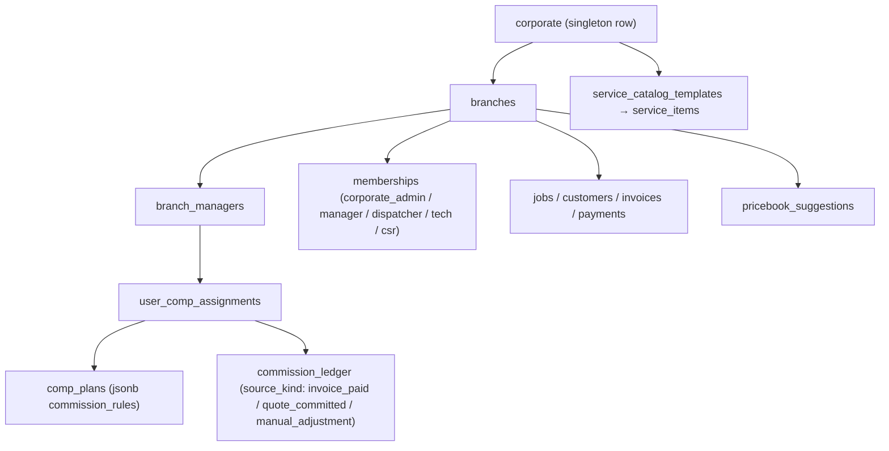
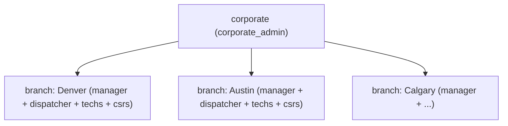
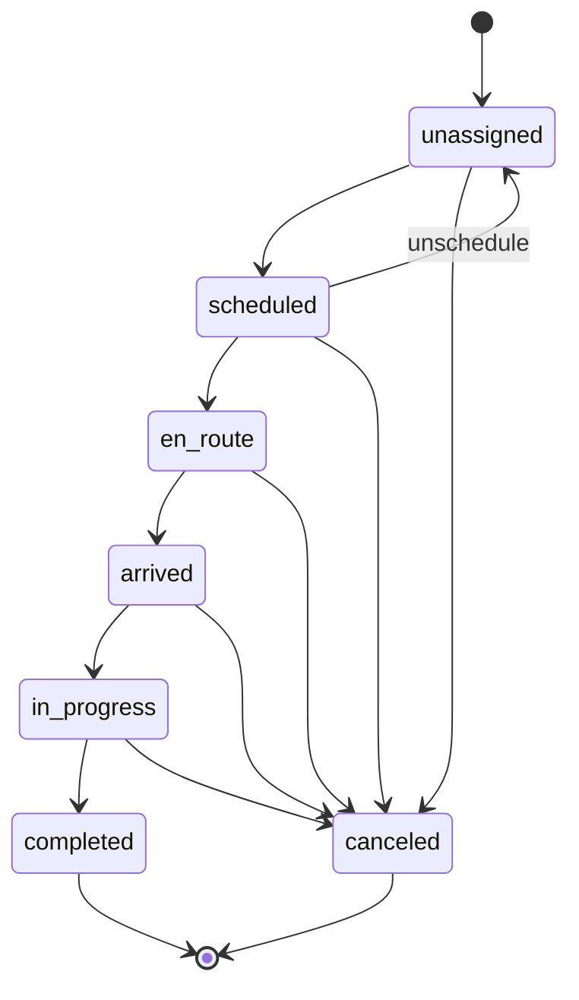

# Service.AI — Architecture

> **Model change callout (2026-05).** Service.AI shipped its first 13 phases on a franchise tenancy model (platform → franchisor → franchisee → location). Phase 14 (`phase_corporate_hub_redesign`, tasks CHR-01..12) replaced it with the **corporate hub-and-spoke** model documented in sections 2–6 below. Migration `0016_corporate_hub_redesign.sql` is the load-bearing piece; `packages/db/src/scope.ts` is the canonical type. The franchise model is preserved as **Appendix A** so rollback and migration debugging stay tractable.

## 1. Stack

| Layer | Choice | Reason |
|---|---|---|
| Language | TypeScript (strict) | Single language across API, web, voice, mobile |
| Monorepo | pnpm workspaces + Turborepo | Fast incremental builds, shared types |
| API | Fastify 5 + Zod + ts-rest | Mature, fast, rich plugin ecosystem, shared schemas without tRPC lock-in |
| Frontend | Next.js 15 (App Router) + React 19 + Server Components | Fast, progressive rendering |
| UI | Tailwind + shadcn/ui | Brandable via CSS variables |
| Mobile | PWA (v1) → React Native v2 | Ship fast, no app stores |
| Database | Postgres 16 (DO Managed) | Single tenant key (`branch_id`) with row-level scoping |
| ORM | Drizzle | Type-safe, SQL migrations, no magic |
| Cache / queue | Redis 7 (DO Managed) + BullMQ | Job queue for AI tasks, collections, monthly commission rollups |
| Voice | Fastify WS server + Twilio Media Streams + Deepgram + ElevenLabs | Greenfield, same providers as Donna PA |
| AI router | Custom thin layer over Anthropic SDK + xAI SDK | Per-capability routing; swap-friendly |
| AI reasoning | Claude (Opus 4.7 default, Sonnet 4.6 for bulk) | Tool-use strength, instruction-following |
| AI bulk / web-context | Grok (via xAI API) | Cost-efficient summarisation |
| Vision | Claude Sonnet 4.6 vision | Photo-to-quote, door identification |
| Vector store | Postgres + pgvector | One fewer service; fine for v1 scale |
| Auth | Better Auth (self-hosted) | Schema-owned, plays with Drizzle |
| Payments | Stripe (single corporate account) | One merchant relationship; commission engine reads `payments` directly. **Connect Standard / per-branch payouts dropped in CHR-08.** |
| SMS / Voice infra | Twilio | Provisioned numbers per branch, Media Streams for voice WS |
| Maps | Google Maps (Places + Geocoding + Distance Matrix) | Address autocomplete mid-call is the killer feature |
| Storage | DO Spaces (S3-compatible) | Photos, call recordings |
| Email | Resend | Transactional + collections |
| Observability | Axiom (logs) + Sentry (errors) + OpenTelemetry | Low ops, good signal-to-noise |
| CI/CD | GitHub Actions → DO App Platform on push to main | Matches OPENDC pattern |
| Testing | Vitest (unit + integration) + Playwright (E2E) + k6 (perf) | TS-native |

## 2. Service topology

Three deployable services (one repo, one shared package set):

```
servicetitan-clone/
├── apps/
│   ├── web/          Next.js 15 — office UI, dispatch board, /corporate hub, /branch manager dashboard
│   ├── api/          Fastify API — corporate-routes.ts, branch-routes.ts, commission-engine.ts, ...
│   └── voice/        Fastify WS — Twilio Media Streams + Deepgram + ElevenLabs
├── packages/
│   ├── db/           Drizzle schema + migrations (0016 is the corporate hub redesign)
│   ├── contracts/    Zod schemas + ts-rest route definitions (incl. comp-plans.ts)
│   ├── ai/           Multi-provider LLM router, prompt library, RAG client
│   ├── auth/         Better Auth config + middleware
│   └── ui/           shadcn component library
└── tools/            scripts, seeds, migrations tooling
```

Web talks to API only via the ts-rest contracts in `packages/contracts`. Voice talks to API for business actions (create job, update status). **No direct DB access from web or voice — API is the only writer.**

## 2a. Package dependency graph

```
apps/web    → packages/contracts   (shared Zod schemas + ts-rest client)
apps/web    → packages/ui
apps/web    → packages/auth

apps/api    → packages/contracts
apps/api    → packages/db          (Drizzle ORM schema + Pool client)
apps/api    → packages/ai
apps/api    → packages/auth

apps/voice  → packages/ai
apps/voice  → packages/auth

packages/auth → packages/db
packages/ai / packages/db / packages/contracts / packages/ui → external deps only
```

**Forbidden edges (enforced by CLAUDE.md):**
- `apps/web` → `packages/db` — all writes go through `apps/api`
- `apps/voice` → `packages/db` — same
- Any package → direct LLM SDK import — all LLM calls route through `packages/ai`

**Public (token-gated) route groups.** Some API routes run **outside**
RequestScope — there is no session for the caller. The auth is an
unguessable token in the URL path. Today: `public-invoice-routes.ts` (pay a
finalized invoice) and `public-quote-routes.ts` (CQA — accept a quote, fetch
its PDF, pay a deposit). These select an explicit field whitelist (never
`SELECT *`) so internal columns can't leak, and write with a synthetic scope
so production RLS still fires. The web counterparts live outside the `(app)`
group: `app/invoices/[token]/pay` and `app/quotes/[token]/accept`.

CQA (migration 0019) adds customer-acceptance + deposit columns to `quotes`
(`accept_token`, `accept_token_expires_at`, `accepted_channel`,
`deposit_amount_cents`, `deposit_payment_intent_id`, `deposit_paid_at`) and a
deposit policy to `corporate` (`deposit_pct`, `deposit_min_cents`,
`deposit_max_cents`). See `docs/api/customer-acceptance.md`.

## 2b. Local vs. DO environment parity

| Concern | Local (Docker Compose) | DO App Platform |
|---|---|---|
| Postgres | `postgres:16-alpine` container, port 5434 on host | DO Managed Postgres 16 |
| Redis | `redis:7-alpine` container, port 6381 on host | DO Managed Redis 7 |
| Secret injection | `.env` file (gitignored) → Docker `environment:` | DO App Platform env vars (encrypted at rest) |
| Connectivity | Services reach each other by Docker service name | Same DNS pattern via DO's internal VPC |
| Ports | web:3000, api:3001, voice:8080 | Each service on its own DO App subdomain |
| Build | `pnpm dev` with tsx watch | `pnpm build` → artifact; auto-deploy on push to `main` |
| Observability | Axiom + Sentry disabled when env vars absent | Tokens injected via DO env |

`DATABASE_URL` and `REDIS_URL` env var names are identical in both environments, ensuring zero code-path differences between local and deployed.

## 3. Data model (corporate hub)

The full schema lives in `packages/db/src/schema.ts` and its migrations. This section lists the load-bearing tables only.

### Tenancy & auth

- `corporate(id, name, slug, legal_entity_name, timezone, currency_code, brand_assets, brand_voice, default_margin_pct, min_margin_pct, max_margin_pct, created_at, updated_at)` — **single row**, inserted at bootstrap. Holds corporate-wide knobs (default supplier margin, brand voice the AI inherits when a branch has nothing of its own).
- `branches(id, corporate_id, name, slug, legal_entity_name, address_line1, address_line2, city, region, postal_code, country_code, timezone, phone_number, twilio_phone_number, twilio_phone_sid, stripe_account_id, brand_voice, status, created_at, updated_at)` — the spokes. `status ∈ (active, paused, closed)`. `stripe_account_id` is here for future per-branch payouts; v1 leaves it null because every charge flows through the single corporate Stripe account.
- `branch_managers(id, branch_id, user_id, started_at, ended_at, created_at)` — manager assignment history. Partial unique index `(branch_id) WHERE ended_at IS NULL` guarantees at most one active manager per branch.
- `users(id, email, name, phone, ...)` — global identity (Better Auth).
- `memberships(id, user_id, scope_type, scope_id, role, branch_id, ...)` — `scope_type ∈ (corporate, branch)`, `role ∈ (corporate_admin, manager, dispatcher, tech, csr)`.
- `sessions`, `accounts`, `verifications` — Better Auth.
- `audit_log(id, actor_user_id, scope_type, scope_id, action, target_table, target_id, target_branch_id, metadata, ip_address, user_agent, created_at)` — every privileged write captured. (The franchisor-impersonation audit volume is gone; corporate reads no longer produce audit rows because there is no cross-tenant pretence to record.)

### Compensation (new in CHR)

- `comp_plans(id, name, kind, base_salary_cents, pay_period, commission_rules jsonb, effective_from, effective_to, ...)` — `kind ∈ (base_plus_commission, commission_only)`, `pay_period ∈ (monthly, biweekly)`. `commission_rules` validates against the Zod schema in `packages/contracts/src/comp-plans.ts` (three rule kinds — see §6c).
- `user_comp_assignments(id, user_id, comp_plan_id, branch_id, effective_from, effective_to, created_at)` — who is on which plan when. Partial unique index keeps "one active assignment per user".
- `commission_ledger(id, user_id, branch_id, source_kind, source_id, amount_cents, rule_snapshot jsonb, period_label, created_at)` — append-only. `source_kind ∈ (invoice_paid, quote_committed, manual_adjustment)`. Unique index on `(user_id, source_kind, source_id)` enforces idempotent writes. `rule_snapshot` freezes the rule JSON that fired so historical totals survive later edits to `comp_plans`.

### Core (trade-agnostic)

- `customers(id, branch_id, name, phone, email, address_*, place_id, lat, lng, notes, deleted_at, ...)` — soft-deleted. Address denormalised from Google Places alongside the canonical `place_id`.
- `jobs(id, branch_id, customer_id, tech_user_id, status, scheduled_*, actual_*, summary, metadata_jsonb, ...)`
- `job_status_log(id, job_id, branch_id, from_status, to_status, actor, at)` — append-only transition history.
- `job_photos(id, job_id, branch_id, url, kind, taken_at)` — bytes in DO Spaces.

### Pricebook (corporate-owned)

- `service_catalog_templates(id, name, status, published_at, ...)` — versioned draft / published / archived. Owned by corporate; the per-franchisor scoping is gone. Invariant: at most one `published` template at a time.
- `service_items(id, template_id, sku, name, description, category, base_price, floor_price, ceiling_price, trade)` — corporate-owned line items.
- `pricebook_suggestions(id, branch_id, service_item_id, suggested_price_cents, reason, suggested_by_user_id, status, resolved_by_user_id, resolved_at, resolution_note, created_at)` — **replaces** `pricebook_overrides`. Manager proposes, corporate approves. v1 has no automatic apply path: an approval just records the decision (corporate edits the catalog item manually if they want the change to take effect).

### Invoicing & payments

- `invoices(id, branch_id, job_id, customer_id, subtotal, tax, total, status, stripe_payment_intent_id, payment_link_token, created_at, ...)`
- `invoice_line_items(id, invoice_id, branch_id, service_item_id, description, qty, unit_price, total)`
- `payments(id, invoice_id, branch_id, stripe_charge_id, stripe_payment_intent_id, amount, status, paid_at)` — **no `application_fee_amount`** (CHR-08 removed it).
- `refunds(id, payment_id, branch_id, stripe_refund_id, amount, reason, created_at)`
- `stripe_events(stripe_event_id, ...)` — webhook idempotency.

### AI

- `ai_conversations(id, kind, branch_id, initiator_user_id, metadata_jsonb, started_at, ended_at)` — `kind ∈ (voice_csr, dispatcher_suggestion, tech_assist, collections_draft)`
- `ai_messages(id, conversation_id, branch_id, role, content, tool_calls_jsonb, provider, model, tokens_in, tokens_out, created_at)`
- `ai_suggestions / ai_feedback / ai_metrics` — dispatcher + tech-assistant feedback loops.
- `kb_docs(id, source_kind, title, content, embedding, metadata_jsonb)` — corporate-owned (the `franchisor_id` column was dropped in CHR-01).

### Voice & telephony

- `phone_numbers(id, branch_id, twilio_sid, e164, provisioned_at, active)`
- `call_sessions(id, branch_id, phone_number_id, from_e164, to_e164, direction, ai_conversation_id, recording_url, duration_sec, outcome, started_at, ended_at)`

### Tables removed in CHR

`franchisors`, `franchisees`, `franchise_agreements`, `royalty_rules`, `royalty_statements`, `pricebook_overrides`. See Appendix A for what they used to do. Migration 0016's down path recreates the schemas but cannot restore royalty row data.

### Data model diagram (corporate hub)



## 4. API contract style

- **REST + OpenAPI**, generated from ts-rest route definitions in `packages/contracts`.
- All endpoints namespaced `/api/v1/...`. Every endpoint returns `{ ok: true, data }` or `{ ok: false, error: { code, message, details? } }`.
- Auth: `Authorization: Bearer <session_token>` (Better Auth). **No impersonation header / cookie** (CHR-02 removed it).
- Pagination: cursor-based, `limit` + `cursor`, response includes `nextCursor`.
- Idempotency: every POST accepts `Idempotency-Key` header; enforced via Redis 24h TTL.
- Rate limits: per-user per-endpoint via Fastify rate-limit plugin + Redis.
- Cross-tenant access returns `404 NOT_FOUND` so the caller cannot infer the existence of a branch they shouldn't see.

## 5. Auth & RBAC

Better Auth manages sessions. Authorization is a Fastify plugin (`apps/api/src/request-scope.ts`) that resolves the effective scope from the `memberships` table.

### Roles (5; was 7 pre-CHR)

- `corporate_admin` — scope=corporate. Sees every branch natively.
- `manager` — scope=branch. Runs one branch.
- `dispatcher` — scope=branch.
- `tech` — scope=branch.
- `csr` — scope=branch.

### Tenancy hierarchy



Every membership row lives in one box above. `RequestScope` is a discriminated-union view of which box the caller currently stands in.

### Request context (RequestScope)

On every authenticated request, `requestScopePlugin` attaches:

- `request.userId` — Better Auth session user id, or null for anonymous.
- `request.scope` — one of:
  - `{ type: 'corporate', userId, role: 'corporate_admin' }`
  - `{ type: 'branch', userId, role: 'manager' | 'dispatcher' | 'tech' | 'csr', branchId }`
- `request.requireScope()` — throws 401/403 with a structured error code when the caller is unauthenticated or has no active membership.

The scope is consumed by `withScope(db, scope, fn)` from `@service-ai/db`, which opens a transaction, sets three session GUCs (`app.role`, `app.branch_id`, `app.user_id`) via `set_config(..., true)` so they auto-clear at commit/rollback, then runs the callback inside. The corporate variant passes an empty string for `branchId`; the policy migration uses `nullif(..., '')::uuid` so empty strings coerce to NULL and only the `_corporate_admin` policy permits the read.

### No impersonation

There is no `X-Impersonate-Franchisee` header, no `serviceai.impersonate` cookie, no HQ banner, no `/impersonate/start` / `/impersonate/stop` routes. Corporate sees every branch natively because the `_corporate_admin` RLS policy is permissive. The legacy impersonation surface was deleted in CHR-02 along with the `(app)/HqBanner.tsx` component.

## 6. Multi-tenancy (rows, not schemas)

Single database, single schema, row-level scoping enforced in two layers:

1. **Application layer** — every tenant-scoped endpoint reads `request.scope`, composes a WHERE clause against it (e.g. `eq(jobs.branchId, scope.branchId)`), and runs the query inside `withScope()`.
2. **Postgres RLS (defence in depth)** — every tenant-scoped table has `ROW LEVEL SECURITY ENABLED` + `FORCE ROW LEVEL SECURITY` plus **two** policies per table:
   - `<table>_corporate_admin` — permissive for `current_setting('app.role') = 'corporate_admin'`
   - `<table>_scoped` — matches `branch_id = nullif(current_setting('app.branch_id'), '')::uuid` for any other role

The three-policy template from the franchise era (`_platform_admin` / `_franchisor_admin` / `_scoped`) collapsed to two because the corporate role replaces both the platform-bypass and franchisor-admin layers.

**Production note:** RLS only fires when the DB role is non-superuser. DO Managed Postgres provides a non-superuser app role by default. The dev docker-compose Postgres creates a superuser (`builder`), so RLS is bypassed there; the app-layer WHERE clauses are the primary check on that connection. Tests that need to verify RLS directly use a `rls_test_user` role created at test setup — see `packages/db/src/__tests__/live-rls.test.ts`.

## 6a. Customer / job model (phase_customer_job)

Four tables, all branch-scoped with the two-policy RLS template:

| Table            | Purpose |
|------------------|---------|
| `customers`      | End customers. Soft-deleted. Address fields denormalised from Google Places alongside `place_id`. |
| `jobs`           | Customer-bound work items. `status` column carries the current state; `scheduled_*` vs `actual_*` timestamps track lifecycle. |
| `job_status_log` | Append-only transition history. Denormalised `branch_id` so RLS matches with a single-column predicate. |
| `job_photos`     | Photo metadata only. Bytes live in DO Spaces; storage cleanup on delete deferred to v2. |

### Job status state machine



Transitions are enforced in the API layer by `canTransition(from, to)` in `apps/api/src/job-status-machine.ts`. The API writes the status update and `job_status_log` row in a single transaction so status and log never drift. The web UI reads the same matrix (`validTransitionsFrom`) to render only legal next steps.

### Photo upload flow

Browser-direct upload to DO Spaces. Three steps:

1. `POST /api/v1/jobs/:id/photos/upload-url` → presigned PUT URL + `storageKey` (`jobs/<jobId>/photos/<uuid>.<ext>`).
2. Browser PUTs the bytes directly.
3. `POST /api/v1/jobs/:id/photos` with `{ storageKey, contentType, sizeBytes }` → API writes a `job_photos` row inside `withScope()`.

The API validates the `storageKey` prefix to prevent cross-job claims.

## 6b. Corporate hub + branch dashboard (CHR-06, CHR-07)

### `/corporate/*` (corporate_admin only)

- `/corporate` — network overview tiles (revenue MTD, AR open, jobs MTD, branch count) + a per-branch table (revenue / AR / jobs / commission paid / manager name).
- `/corporate/branches` — branches list with status, manager, monthly revenue, commission paid out.
- `/corporate/branches/new` — three-step wizard: legal name + address (Google Places) + timezone → Twilio number provision → assign manager (search existing users or create one with `manager` role). **No** franchise agreement, **no** Stripe Connect onboarding, **no** pricebook template publish.
- `/corporate/branches/:id` — manager history, comp-plan assignment, status toggle (`active → paused` requires confirm), branch-filtered audit log.
- `/corporate/managers` — directory of all branch managers across the network with current comp-plan, MTD revenue, MTD commission.
- `/corporate/comp-plans` — list, create, edit. Form enforces the Zod schemas in `packages/contracts/src/comp-plans.ts`.
- `/corporate/pricebook-suggestions` — review queue for `pricebook_suggestions` rows. Approve / reject with note; approval is a decision record (manual apply path in v1).

Non-corporate roles get `notFound()` on `/corporate/*`.

### `/branch` (manager only)

Tile row: branch revenue MTD, AR open, jobs in flight, **projected commission this period**.

Pipeline card: committed quotes that have not been invoiced yet (these will earn commission once they convert, for plans tied to `invoice_paid`).

Recent jobs + a "go to dispatch board" CTA. Manager sees only their branch.

## 6c. Compensation + commission engine (CHR-04, CHR-05)

### Comp plan schema (`packages/contracts/src/comp-plans.ts`)

Three rule kinds in v1, all serialised as JSONB on `comp_plans.commission_rules`:

| Kind | Shape | Fires when |
|---|---|---|
| `flat_percent_of_invoice_paid` | `{ kind, percent: 0..100 }` | invoice status → paid; `commission = round(invoice_total × percent / 100)` |
| `tiered_percent_of_invoice_paid` | `{ kind, tiers: [{ floorCents, percent }] }` (first tier `floorCents = 0`, strictly ascending) | invoice status → paid; highest-floor tier whose floor ≤ invoice total wins |
| `flat_percent_of_quote_committed` | `{ kind, percent: 0..100 }` | supplier quote committed (SQB); pays the closer before invoice cycle; reversed if quote later voided |

Route handlers parse rules with `parseCommissionRule` and surface field-level errors as `400 INVALID_COMP_PLAN`.

### Commission engine (`apps/api/src/commission-engine.ts`)

Two surfaces:

**Transition functions:**

- `onInvoicePaid(invoiceId, tx)` — fires when an invoice flips to `paid`. v1 awards 100% to the branch's current manager. Resolves the manager's active comp plan as of `invoice.paidAt`, runs every `flat_percent_of_invoice_paid` / `tiered_percent_of_invoice_paid` rule, writes one `commission_ledger` row per rule that fires.
- `onQuoteCommitted(quoteId, tx)` — same lookup but for `flat_percent_of_quote_committed` rules. Credits `closer_user_id`, not the manager.
- `reverseInvoicePaid(invoiceId, tx)` — writes a balancing row with `source_kind='manual_adjustment'` and a negated amount when an invoice is refunded. Idempotent: replays do not write a second reversal.
- `reverseQuoteCommitted(quoteId, tx)` — analogue for quote void.

**Pure projector:**

- `computeCommission(tx, userId, periodLabel)` → `{ period, baseSalaryCents, commissionCents, totalCents, lineItems[] }`. Sums the ledger across the period plus prorated base salary from the user's active comp plan. The manager dashboard renders this directly.

**Idempotency:** the unique index `(user_id, source_kind, source_id)` on `commission_ledger` means inserts use `ON CONFLICT DO NOTHING`; replays cannot duplicate accrual.

**Snapshot:** every ledger row carries `rule_snapshot` (the rule JSON at calc time). Statements survive later comp-plan edits without changing historical totals.

A monthly BullMQ job rolls up the ledger into `commission_statements` (read model only; payroll dispatch is out of scope for v1).

## 6d. Dispatch + realtime (phase_dispatch_board)

Phase 5 adds the dispatch board + live propagation of assignment and status changes across every open session within a branch.

### EventBus

`apps/api/src/event-bus.ts` defines a minimal publish / subscribe interface with a default in-process `EventEmitter` impl. Events carry **ids only** — never job titles, customer names, or prices — so receivers re-fetch through `/api/v1/jobs/:id` which is scope-filtered. Multi-host deployments swap in a Redis pub/sub adapter; same interface.

### Server-Sent Events

`GET /api/v1/jobs/events/stream` returns `text/event-stream`. Subscribers pass through `requestScopePlugin`, so the server computes a scope-filter predicate on connect:

- Branch scope → only events in that branch.
- Corporate scope → events in every branch.

15-second comment heartbeat keeps proxies happy. Cleanup is registered on both `close` and `error` so subscribers don't leak.

### Assignment endpoint

`POST /api/v1/jobs/:id/assign` validates the target tech is an active `tech` membership in the job's branch (cross-branch or non-tech → `400 INVALID_TARGET`). If the job was `unassigned` the handler atomically transitions it to `scheduled` and writes a `job_status_log` row in the same transaction. Publishes `job.assigned` (+ `job.transitioned` if the side-effect fires).

`POST /api/v1/jobs/:id/unassign` clears the assignment and, when the job was `scheduled` with no explicit times, reverts the status to `unassigned`.

### Conflict model

Optimistic client moves + last-write-wins on the server. The SSE stream re-syncs every session within the gate's **p95 < 500 ms** budget (verified by a 10-subscriber latency harness in `live-sse-latency.test.ts`).

## 6e. Pricebook (corporate-owned, branch suggestions)

Single corporate catalog → every branch reads the same resolved pricebook.

| Table | Owner | Purpose |
|---|---|---|
| `service_catalog_templates` | corporate | Versioned draft / published / archived. Invariant: at most one `published` at a time. |
| `service_items`             | corporate | Line items with `base_price`, nullable `floor_price` + `ceiling_price`, category, unit, sku. |
| `pricebook_suggestions`     | branch    | Manager proposes a price change; corporate approves / rejects with note. **No automatic apply path in v1** — approval is a decision record. |

### Resolved pricebook

`GET /api/v1/pricebook` returns the items of the currently `published` template. There are no per-branch overrides anymore; every branch sees the same prices.

### Floor / ceiling invariant

```
floor_price ≤ base_price ≤ ceiling_price    (when each bound is set)
```

Violations on suggestion creation return `400 PRICE_OUT_OF_BOUNDS`.

### Read-only scoped RLS policy

Catalog tables (`service_catalog_templates`, `service_items`) have the two-policy template, with the `_scoped` policy reduced to `USING (false)` so non-corporate roles can read via API only (the API joins through `withScope` as `corporate_admin` for these read-only catalog endpoints when serving branch-scoped users). See migration 0016 for the pattern.

## 6f. AI CSR voice — phase_ai_csr_voice

The voice service takes an inbound Twilio call and books a job end-to-end. Caller greeted → name + address + symptom collected → tech availability checked → job booked → SMS confirmation → job on the dispatch board.

### Adapter boundary surfaces

| Adapter | Interface | Stub (default) | Real wiring |
|---|---|---|---|
| Anthropic (Claude) | `AIClient.turn()` | `stubAIClient({script})` | `anthropicAIClient(key)` |
| Twilio | `TelephonyClient.{provisionNumber, verifyWebhookSignature, sendSms, initiateTransfer}` | `stubTelephonyClient()` | `realTelephonyClient(sid, token)` |
| Deepgram | `AsrClient.open() → AsrSession` | `stubAsrClient({scripts})` | (lands when first pilot streams) |
| ElevenLabs | `TtsClient.speak()` | `stubTtsClient()` | (lands alongside Deepgram) |

Stubs are deterministic (e.g. `stubTelephonyClient.provisionNumber` hashes `branchId` into a stable `+1555xxxxxxx`).

### Agent loop (`packages/ai`)

`runAgentLoop` pumps the model with `tool_use` results until a `text` turn ends the conversation (or `maxSteps` hits). Before executing a tool, the loop compares the assistant's reported confidence against `ctx.guardrails.confidenceThreshold`; if the tool is in `gatedTools` and confidence is below threshold, the loop substitutes `transferToHuman` for the original call.

### CSR tools (`apps/api/src/ai-tools/csr-tools.ts`)

`lookupCustomer`, `createCustomer`, `proposeTimeSlots`, `bookJob`, `transferToHuman`, `logCallSummary` — all branch-scoped. `bookJob` and `createCustomer` are in `CSR_GATED_TOOLS` because they write tenant-affecting data.

### Twilio webhook + WS streams

`POST /voice/incoming` — Twilio webhook. Signature verified. Unknown `To` numbers → TwiML hang-up; known numbers → `<Connect><Stream>` with the **branch id** encoded in a custom parameter.

`WS /voice/stream` — Twilio Media Streams handler. `start` spins up the orchestrator; `media` events push frames; `stop` / socket close tears it down.

### Guardrails + phone provisioning

**Static guardrails fallback.** The `franchisees.ai_guardrails` JSONB column went away with the table in CHR-01. Until a per-branch guardrails surface lands (v1.5 — see `docs/TECH_DEBT.md`), the runtime uses static defaults: `confidenceThreshold: 0.8`, `undoWindowSeconds: 900`, `transferOnLowConfidence: true`.

Admin endpoints: `POST /branches/:id/phone/provision` (idempotent), `GET /branches/:id/phone`. Both `corporate_admin`-only.

## 6g. AI dispatcher — phase_ai_dispatcher

Tools: `listUnassignedJobs`, `listTechs({skill?})`, `getTechCurrentLoad`, `computeTravelTime` (DistanceMatrix adapter), `proposeAssignment` (captures without writing), `applyAssignment`.

`runDispatcher(deps, { scope, branchId })` wraps `runAgentLoop`. For every `proposeAssignment` captured: insert an `ai_suggestions` row, validate scheduling invariants (no double-book; skill match; travel-budget fit), then auto-apply when confidence ≥ threshold or leave pending with a `rejectedInvariant` reason.

`DistanceMatrixClient` — stub uses haversine + 35 mph; real impl calls Google Distance Matrix, falls back to stub on failure with a WARN log.

Cancellation reflow: `dispatcher-reflow.ts` subscribes to `job.transitioned` events; when `toStatus='canceled'`, any pending `ai_suggestions` rows targeting that job flip to `expired`.

UI: dispatch board grows a right-rail `AiSuggestionsPanel` with pending suggestions (tech, reasoning, confidence, scheduled time) + Approve / Reject + a "Suggest" button.

## 6h. AI tech assistant — phase_ai_tech_assistant

Two capabilities the field tech reaches from the PWA:

- **Photo quote**: tap → camera → AI identifies make / model / failure → suggests 3 line items from the corporate pricebook, each tagged with confidence + supporting KB sources + `requiresConfirmation: true` for items above the static `techPhotoQuoteCapCents` default.
- **Draft from notes**: rough notes text → customer-facing invoice description (single-turn AI call).

Data model (migration 0012): `kb_docs` (corporate-owned after CHR), `ai_feedback` (accept/override telemetry).

Pluggable adapters: `EmbeddingClient` (stub: deterministic SHA-256 → 32-dim), `VisionClient` (stub: fixture-table lookup).

`retrieveKnowledge(tx, { query, limit, requireTags? })` embeds → loads candidates → optional tag prefilter → in-memory cosine → top-N.

photoQuote pipeline: vision → KB retrieval → extract `sku:` tags → look up SKUs in the active published catalog template → score `min(1, visionConfidence + 0.05 × supportingDocCount)` → flag items above the static cap → persist to `ai_conversations` + `ai_messages`.

API: `POST /jobs/:id/photo-quote`, `POST /jobs/:id/notes-to-invoice`, `POST /ai/feedback` — tech / dispatcher / manager; CSR → 403.

## 6i. AI collections — phase_ai_collections

Aging invoices at 7 / 14 / 30 days get AI-drafted SMS + email in three tones (friendly / firm / final). The manager reviews the queue, edits or approves, and the `EmailSender` + `SmsSender` adapters fire the send.

Data model (migration 0013): `collections_drafts` (partial unique index on `(invoice_id, tone) WHERE status='pending'` prevents duplicate pending rows), `payment_retries` (scheduled retries for failed PaymentIntents). The franchisee-scoped `ai_guardrails.collections` config went away with the table; cadence defaults are static.

Pipeline (`apps/api/src/ai-collections.ts`): `collectionsDraft` (single AI turn per invoice+tone), `selectAgedInvoices` (pure projector — most-severe tone the invoice crossed), `runCollectionsSweep`, `schedulePaymentRetry` (failure-code → delay lookup; caps at 4 attempts), `computeCollectionsMetrics` (DSO + recovered revenue over trailing 30 days).

API: `POST /collections/run`, `GET /collections/drafts?status=`, `POST /drafts/:id/{approve,edit,reject}`, `GET /collections/metrics`, `POST /payments/retries/:id/run`. Role gate: `corporate_admin` + `manager` + `dispatcher`. Tech + CSR → 403.

UI: `/collections` renders three metric tiles (DSO, open receivables, recovered-via-retries) + the pending-drafts queue with inline edits.

## 7. AI layer

### Router (`packages/ai`)
- Single `AI.call(capability, input)` interface. Capability examples: `csr.intent`, `dispatcher.suggest`, `tech.photoQuote`, `collections.draft`, `kb.retrieve`.
- Each capability has a default provider + fallback list + prompt template + tool list + cost target.
- Token counting, retry with backoff, cost metering per branch.
- All calls persist to `ai_conversations` + `ai_messages` for auditing and later training.

### Knowledge layers
1. **Corporate domain KB** (`kb_docs` — corporate-owned, was franchisor-owned) — garage-door parts catalog, install procedures, common issues. RAG'd at inference.
2. **Per-branch memory** (deferred) — every job outcome, customer note, photo+quote pair will be embedded and retrievable for that branch only. Pre-CHR this was per-franchisee; the equivalent per-branch projection is a v1.5 follow-up.
3. **Cross-branch aggregate** (v1.5+) — corporate can export anonymised aggregate training data across branches for offline fine-tuning. v1 collects and retains; training is a later phase.

### Guardrails (static defaults; per-branch override is v1.5)

- Confidence threshold per capability (default 0.8 auto-applies, below queues for review).
- Dollar cap (default $500 per quote — above requires confirm).
- Undo window (default 15 min on AI-booked appointments).
- Monthly AI spend cap — tracked on `ai_messages`; alerting only in v1.

The `franchisees.ai_guardrails` JSONB column was the per-tenant configuration surface; it went away with the `franchisees` table in CHR-01. The runtime currently reads these static defaults. Re-introducing a per-branch surface (e.g. a `branches.ai_guardrails` JSONB column + a `/corporate/branches/:id/ai-guardrails` UI) is parked in `docs/TECH_DEBT.md`.

## 8. Payments (single corporate Stripe account)

- **One Stripe account** for the whole company. Every `PaymentIntent` is created on that account.
- **No `application_fee_amount`**, no Stripe Connect onboarding, no transfers to per-branch connected accounts (CHR-08 removed all of it).
- Refunds use the standard Stripe refund API.
- Webhooks land at `POST /api/v1/webhooks/stripe` (raw-body parser, signature-verified), idempotency-guarded by inserting `event.id` into `stripe_events` with `ON CONFLICT DO NOTHING`. Handled events: `payment_intent.succeeded`, `payment_intent.payment_failed`, `charge.refunded`, `account.updated` (last one retained but no-op in v1).
- **Commission engine wiring**: the webhook handler for `payment_intent.succeeded` calls `onInvoicePaid(invoiceId, tx)` from `apps/api/src/commission-engine.ts` to write the commission ledger rows. `charge.refunded` (when cumulative refunds equal the total → invoice transitions to `void`) calls `reverseInvoicePaid`. Both run inside the same transaction as the invoice / payment / refund inserts.

### Invoice state machine

- `draft → finalized` (`POST /invoices/:id/finalize`): creates a PaymentIntent on the corporate account, generates a 32-byte base64url `payment_link_token`. 400 `EMPTY_INVOICE` on zero total.
- `finalized → sent` (`POST /invoices/:id/send`): dispatches the payment URL via pluggable `EmailSender` + `SmsSender`. Both channels soft-skipped when the customer lacks the contact.
- `paid` (via webhook): insert a `payments` row keyed on `stripe_charge_id`, flip status + set `paid_at`, **fire `onInvoicePaid`**.
- `void` on full refund: webhook or `POST /refund` inserts a `refunds` row; cumulative refunded amount equals total → status → `void`, **fire `reverseInvoicePaid`**.

Illegal transitions return 409 `INVALID_TRANSITION` with `{ from, to }`.

### Public payment surface

`/api/v1/public/invoices/:token` authenticates by the 32-byte `payment_link_token` (unique partial index). Exposed fields are narrow: customer name, branch name, subtotal / tax / total, paid status, payment-intent id for Stripe Elements.

### PDF receipt

`GET /api/v1/invoices/:id/receipt.pdf` renders via `@react-pdf/renderer`'s `renderToBuffer`. Draft invoices → 409 `INVALID_TRANSITION`.

## 8a. Supplier quote bridge (SQB, 2026-05)

Live quotes against an external supplier (first impl: OPENDC's BC AI Agent, talking to Microsoft Business Central under the Elevated Doors customer account).

**Provider abstraction** at `packages/suppliers`:

- `SupplierProvider` interface — two operations, `priceItems` (read, idempotent, sub-second budget) and `commitQuote` (idempotent on `externalQuoteId`).
- `BcAiAgentProvider` — first real impl. Native fetch, 50/200/800 ms backoff on 5xx + 429, `X-Service-AI-Key` header, request-ID propagation via `X-Request-ID`.
- `MockSupplierProvider` — tests + early prototype.
- `ProviderRegistry` — keyed by `provider_kind`, cached per `supplierId`.

**Tables** (migration `0017_supplier_quote_bridge.sql`):

- `suppliers` — corporate-scoped provider registry (v1 holds one row).
- `margin_overrides` — corporate, keyed by BC `itemCategoryCode`, UNIQUE.
- `quotes` — branch-scoped header with `supplier_quote_ref` (SQ-XXXXXX), `closer_user_id`, status enum.
- `quote_line_items` — per-line price + the margin trail (`applied_margin_pct`, `applied_margin_source`, optional `margin_override_pct` + required `margin_override_reason` via CHECK).
- `quote_status_log` — append-only audit of every transition.

**Margin engine** at `apps/api/src/margin-engine.ts`. Three-level resolution: line override → category override → `corporate.default_margin_pct`. Multiplicative formula (`price = cost × (1 + pct/100)`). Bounds enforced against `corporate.min_margin_pct` / `max_margin_pct`. Cost is re-fetched from the provider on every `/price` call — never trusted from the client.

**State machine** at `apps/api/src/quote-status-machine.ts`. `draft → priced → committed → accepted` with `void` from any non-terminal. `priced → priced` is the live-edit case (status string stable, status_log row written).

**Commission integration**: on `priced → committed`, `onQuoteCommitted` (CHR-05) writes a `commission_ledger` row for `closer_user_id` if their active comp plan has a `flat_percent_of_quote_committed` rule, atomically with the status change. On `committed → void`, `reverseQuoteCommitted` writes the balancing -cents row.

**BC AI Agent surface** (in the `bc-ai-agent` repo): `POST /api/external/price-items`, `POST /api/external/quotes` (idempotent on `external_quote_id` via UNIQUE constraint + in-process lock), plus `POST /api/external-keys` admin CRUD. Auth via bcrypt-hashed `X-Service-AI-Key`. Detailed reference: `docs/api/supplier-quote-bridge.md`.

**Idempotency map**:

| Layer | Key | Backing |
|---|---|---|
| `BcAiAgentProvider.commitQuote` | `externalQuoteId` | passthrough |
| BC AI Agent `/api/external/quotes` | `external_quote_id` body | `external_quote_commits.external_quote_id` UNIQUE + per-key lock |
| Service.AI `/quotes/:id/commit` | `Idempotency-Key` header / body | request body → BC AI Agent |
| `commission_ledger` | `(user_id, source_kind, source_id)` | DB UNIQUE |

10× concurrent commits with the same key collapse to one BC document, one ledger row.

**Observability**: Service.AI's Fastify request id threads through as `X-Request-ID` so one id traces web → Service.AI → BC AI Agent → BC OData. Pino redact list covers `X-Service-AI-Key` in five shapes. Semgrep rules in `.semgrep.yml` block raw key in console.log, direct external fetch from outside `packages/suppliers`, body-derived `branch_id`.

## 9. Voice

Greenfield WS server in `apps/voice`. Flow:

```
Twilio ──HTTP──▶ /voice/incoming (webhook, TwiML → start Media Stream)
     │
     └──WS──▶ apps/voice:8080/voice/stream
             │
             ├─▶ Deepgram streaming ASR
             ├─▶ Claude intent loop with CSR tools (lookupCustomer, createCustomer,
             │   proposeTimeSlots, bookJob, transferToHuman, logCallSummary)
             ├─▶ Tool calls hit apps/api via internal JWT
             ├─▶ ElevenLabs TTS → µ-law 8kHz back to Twilio
             └─▶ Writes ai_conversations, call_sessions, audit events
```

Voice service is stateless per call; all persistence via API.

## 10. Tech PWA + offline (phase_tech_mobile_pwa)

### Service worker cache strategy
`apps/web/public/sw.js`:
- **/_next/static/** — cache-first.
- **/api/** — network-first with cache fallback. Successful GETs cached; offline returns last cached response or a 503 JSON envelope. Non-GETs bypass cache.
- **Everything else** — network-first with app-shell fallback.

Scope-limited to origin root. Cross-origin fetches (DO Spaces, Google Maps) bypass it.

### IndexedDB write queue (outbox)
`apps/web/src/lib/offline-queue.ts` — single `outbox` object store keyed by autoincrement id. `apiClientFetch` inspects `navigator.onLine`; when offline AND mutating, enqueues and returns synthetic 202 `{ ok: true, data: { queued: true } }`. GETs bypass. `drain(sender)` replays FIFO; 5xx or network error stops the drain to preserve ordering.

`OfflineQueueDrainer` is mounted inside `TechShell` and listens for `window` `online`; also drains once at mount.

### Web push
`push_subscriptions` is branch-scoped (denormalised `branch_id` so a corporate-fanout send can address all techs in a branch without joining memberships). `endpoint` has a unique partial index (`WHERE deleted_at IS NULL`). Pluggable `PushSender` interface with a `stubPushSender` default; upgrades to real VAPID when `VAPID_PUBLIC_KEY` + `VAPID_PRIVATE_KEY` + `VAPID_CONTACT` are all set.

## 11. Deployment

- **DigitalOcean App Platform**, 3 components: `web`, `api`, `voice`. Auto-deploy from `main` on push.
- **DO Managed Postgres 16**, nightly backups + 7-day PITR.
- **DO Managed Redis**, persistence on.
- **DO Spaces** for photos + recordings.
- **Environment**: `dev` (local compose), `staging` (DO App Platform), `prod` (DO App Platform, separate project).
- **Secrets**: DO App Platform env vars per service.
- **Migrations**: run automatically on deploy via a pre-start hook (`drizzle-kit migrate`).

## 12. Observability

- **Logs**: structured JSON via pino → Axiom.
- **Errors**: Sentry (web + api + voice).
- **Traces**: OpenTelemetry, OTLP → Axiom.
- **Metrics**: per-branch dashboards built from Axiom — revenue, job throughput, AI spend, call count, close rate, commission accrual.
- **Alerts**: Axiom monitors → ntfy.sh + email for sev1; weekly digest for sev2.

## 13. Key decisions (and their tombstones)

| # | Decision | Why | What would reverse it |
|---|---|---|---|
| 1 | Single DB, row-level tenancy by `branch_id` | Cross-branch corporate analytics, ops simplicity | >100 branches with strict data-isolation demands → schema-per-branch |
| 2 | REST over tRPC | External API for partner integrations later | Never need external integrations (unlikely) |
| 3 | PWA before RN | Ship fast | Tech UX breaks down on PWA (camera, offline, push) |
| 4 | Single corporate Stripe account (CHR-08) | One merchant relationship; commission tracked in our own ledger; no Connect onboarding friction | Branches become independent legal entities again → revisit Stripe Connect |
| 5 | Claude + Grok multi-provider | Cost + capability diversity | One becomes clearly superior everywhere |
| 6 | Better Auth over Clerk | Schema control for the role + scope model | Clerk ships multi-org-with-RLS-friendly-claims natively |
| 7 | DO App Platform | Matches Donna target, simple | Need multi-region → Fly.io |
| 8 | Corporate hub-and-spoke (CHR, 2026-05) | GTM moved from franchising to corporate-operated branches; eliminates royalty / Connect / agreement machinery | GTM swings back to franchising → restore Appendix A model |

---

# Appendix A: Pre-2026-05 franchise model

> This describes the data model and architecture **before** the corporate hub redesign. Kept for historical reference and to make rollback / migration debugging tractable. The code paths described here no longer exist; the SQL tables were dropped or renamed in migration `0016_corporate_hub_redesign.sql`. See `phases/phase_corporate_hub_redesign_GATE.md` for the cutover criteria and Section 13 row 8 for the tombstone.

## A.1 Tenancy hierarchy (4 levels)

```
platform_admin → franchisor → franchisee → location → user
                                  │
                                  ├── pricebook overrides
                                  ├── royalty agreement
                                  ├── Stripe Connect account
                                  └── audit-log scope
```

Every membership row lived at one of those four levels (`memberships.scope_type ∈ (platform, franchisor, franchisee, location)`).

## A.2 Roles (7)

`platform_admin`, `franchisor_admin`, `franchisee_owner`, `location_manager`, `dispatcher`, `tech`, `csr`. CHR collapsed the top two into `corporate_admin` and renamed `franchisee_owner` → `manager`; `location_manager` was promoted into `manager` and the `location` scope concept dissolved into branches.

## A.3 Key tables that no longer exist

- `franchisors(id, name, brand_config, created_at)` — top-level brand owner. Collapsed into the single `corporate` row.
- `franchisees(id, franchisor_id, legal_name, stripe_account_id, twilio_number, created_at)` — independent operators. Copied row-for-row into `branches` (UUIDs preserved so existing FKs only had to be renamed, not rewritten).
- `franchise_agreements(id, franchisor_id, franchisee_id, signed_at, effective_at, terminated_at, terms_jsonb)` — contract metadata. Dropped; corporate doesn't need it.
- `royalty_rules(id, agreement_id, rule_type, config_jsonb, active)` — `rule_type ∈ (percentage, flat_per_job, tiered, minimum_floor)`. Dropped; commission engine replaces it.
- `royalty_statements(id, franchisee_id, period_start, period_end, revenue, royalty_owed, adjustments, transferred_at, stripe_transfer_id, status)` — monthly settlement records. Dropped.
- `pricebook_overrides(id, franchisee_id, service_item_id, price, active)` — explicit per-franchisee price overrides for published templates. Dropped; replaced by `pricebook_suggestions` (manager proposes, corporate approves manually).

The down path of migration 0016 recreates these schemas but **cannot restore royalty row data** — the up migration drops the rows. This is acceptable because the corporate model removes royalty accounting entirely.

## A.4 RequestScope (3 variants)

```ts
type RequestScope =
  | { type: 'platform'; userId; role: 'platform_admin' }
  | { type: 'franchisor'; userId; role: 'franchisor_admin'; franchisorId }
  | { type: 'franchisee'; userId; role; franchisorId; franchiseeId; locationId? };
```

`withScope` set three GUCs (`app.role`, `app.franchisor_id`, `app.franchisee_id`); the `franchisor_id` GUC drove the `_franchisor_admin` RLS policy. CHR collapsed the union to `corporate | branch` and the GUCs to `app.role` + `app.branch_id` + `app.user_id`.

## A.5 Impersonation

Franchisor admins could temporarily narrow their scope to a single franchisee they owned via:

1. `X-Impersonate-Franchisee: <uuid>` header on API requests, or
2. `POST /impersonate/start` → set the `serviceai.impersonate` httpOnly cookie (web UI). `POST /impersonate/stop` cleared it.

The scope plugin validated the target, narrowed `request.scope` to `{ type: 'franchisee', ... }`, preserved the original actor on `request.impersonation`, and wrote one `audit_log` row per impersonated request (`action='impersonate.request'`). The `(app)/HqBanner.tsx` component rendered an "HQ viewing" banner on every protected route while the cookie was present.

CHR-02 deleted the header, the cookie, the routes, the banner, and the audit `action='impersonate.request'` plumbing. Corporate sees every branch natively because the `_corporate_admin` RLS policy is permissive.

## A.6 Three-policy RLS template

Every tenant-scoped table carried three named policies:

- `<table>_platform_admin` — permissive for `current_setting('app.role') = 'platform_admin'`.
- `<table>_franchisor_admin` — `franchisor_id = current_setting('app.franchisor_id')::uuid`.
- `<table>_scoped` — `franchisee_id = current_setting('app.franchisee_id')::uuid`.

The CHR migration drops all three on every previously-RLS'd table and re-creates the two-policy template (`_corporate_admin` + `_scoped` keyed on `branch_id`).

## A.7 Stripe Connect Standard

Every franchisee completed Standard Connect onboarding → `franchisees.stripe_account_id` stamped. Every `PaymentIntent` was created on the **franchisee's** account with `application_fee_amount = round(total × royalty_rate × 100)` cents (the royalty engine resolved the rate from the active agreement; default fallback was 5% of total).

Refunds reversed the application fee proportionally. The royalty engine's monthly statement projector reconciled "what Stripe routed to us" vs. "what the current rule set says we should have collected" via Stripe `Transfer` adjustments.

CHR-08 deleted the Connect onboarding flow (`POST /franchisees/:id/connect/onboard`, the `/franchisor/franchisees/[id]/billing` page, the `account.updated`-driven status sync), switched every `PaymentIntent` to the platform's own Stripe account, removed `application_fee_amount`, and replaced the royalty projector with the commission engine (`apps/api/src/commission-engine.ts`).

## A.8 Franchisor console (`/franchisor/*`)

Final phase of the franchise model. `/franchisor` showed network metrics (revenue, AR, AI spend, royalty collected, jobs, franchisee count) with a per-franchisee table and a "View as" quick-impersonate button per row. `/franchisor/onboard` was a four-step wizard (legal name + slug → Twilio number → Stripe Connect → first staff invite). Pricebook template publishing happened at `/franchisor/catalog`.

CHR-06 deleted the whole `/franchisor/*` route tree and replaced it with `/corporate/*` — branches list, branch CRUD wizard (no Stripe Connect step, no pricebook template publish, no franchise agreement step), managers directory, comp-plans, pricebook-suggestions review queue. The "View as" impersonation control is gone; corporate just clicks into a branch detail page and sees the same data the manager sees, natively.

## A.9 AI per-franchisee guardrails

`franchisees.ai_guardrails JSONB` carried per-franchisee config:

```jsonc
{
  "confidenceThreshold": 0.8,
  "undoWindowSeconds": 900,
  "transferOnLowConfidence": true,
  "techPhotoQuoteCapCents": 50000,
  "dispatcherAutoApplyThreshold": 0.8,
  "collections": {
    "autoSendTone": null,
    "cadenceDaysFriendly": 7,
    "cadenceDaysFirm": 14,
    "cadenceDaysFinal": 30
  }
}
```

A `PATCH /franchisees/:id/ai-guardrails` endpoint (platform or owning franchisor admin) let HQ tighten these per-tenant.

The column went away with the `franchisees` table in CHR-01. The AI runtime now uses static defaults with the same values. A per-branch surface (`branches.ai_guardrails` column + a `/corporate/branches/:id/ai-guardrails` UI) is the planned v1.5 successor — see `docs/TECH_DEBT.md`.

## A.10 Why the franchise model was abandoned

GTM changed. The original plan was a franchising business (independent legal entities operating under the Service.AI brand). Mid-build the user pivoted to corporate-operated branches run by W2 managers on base + commission. The franchise scaffolding — franchise agreements, royalty engine, Stripe Connect, per-franchisee Twilio gated on contract signing, impersonation, HQ banner — was overhead the product would never need. CHR ripped it out in a single coordinated phase rather than letting it linger as dead code.
