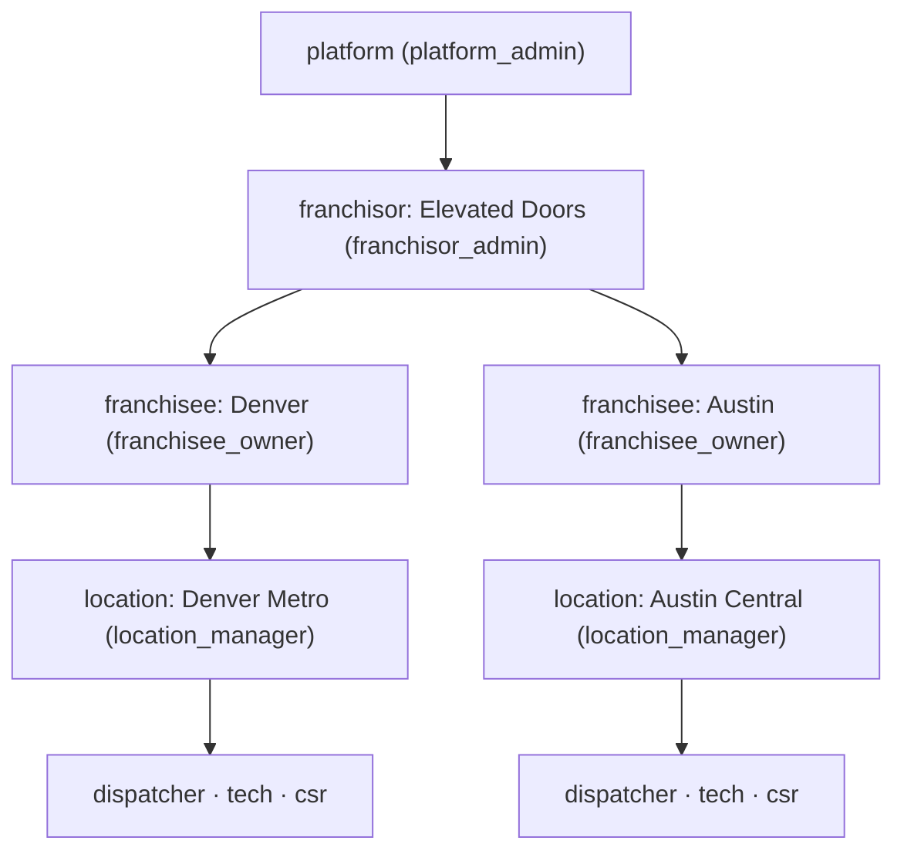
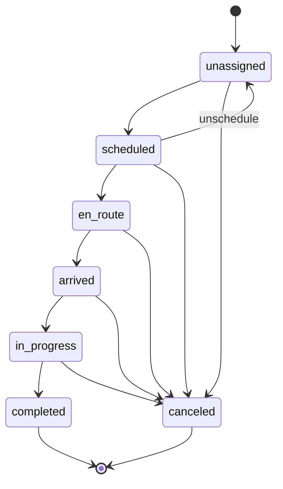

# Service.AI — Architecture

## 1. Stack

| Layer | Choice | Reason |
|---|---|---|
| Language | TypeScript (strict) | Single language across API, web, voice, mobile |
| Monorepo | pnpm workspaces + Turborepo | Fast incremental builds, shared types |
| API | Fastify 5 + Zod + tRPC-style shared contracts via ts-rest | Mature, fast, rich plugin ecosystem, shared schemas without tRPC lock-in |
| Frontend | Next.js 15 (App Router) + React 19 + Server Components | Fast, progressive rendering, matches Joey's existing muscle memory |
| UI | Tailwind + shadcn/ui | Same as OPENDC portal; franchise-brandable via CSS variables |
| Mobile | PWA (v1) → React Native v2 | Ship fast, no app stores; keep tech UI mobile-first so RN port is a shell |
| Database | Postgres 16 (DO Managed) | Franchise tenancy with row-level scoping, proven at this scale |
| ORM | Drizzle | Type-safe, migrations in SQL, no magic |
| Cache / queue | Redis 7 (DO Managed) + BullMQ | Job queue for AI tasks, collections, royalty calculations |
| Voice | Fastify WS server + Twilio Media Streams + Deepgram (streaming ASR) + ElevenLabs (TTS) | Greenfield but same providers as Donna PA |
| AI router | Custom thin layer over Anthropic SDK + xAI SDK (OpenAI-compat) | Per-capability routing; swap-friendly |
| AI reasoning | Claude (Opus 4.7 default, Sonnet 4.6 for bulk) | Tool-use strength, instruction-following |
| AI bulk / web-context | Grok (via xAI API) | Cost-efficient summarization, real-time X/web lookups if ever needed |
| Vision | Claude Sonnet 4.6 vision | Photo-to-quote, door identification |
| Vector store | Postgres + pgvector | One fewer service; works for v1 scale |
| Auth | Better Auth (self-hosted) | Schema-owned, plays with Drizzle, handles 4-level hierarchy |
| Payments | Stripe Connect Standard | Franchisee owns merchant relationship; application_fee_amount = royalty |
| SMS / Voice infra | Twilio | Provisioned numbers per franchisee, Media Streams for voice WS |
| Maps | Google Maps (Places API + Geocoding + Distance Matrix) | Address autocomplete mid-call is the killer feature |
| Storage | DO Spaces (S3-compatible) | Photos, call recordings |
| Email | Resend | Transactional + collections |
| Observability | Axiom (logs) + Sentry (errors) + OpenTelemetry | Low ops, good signal-to-noise |
| CI/CD | GitHub Actions → DO App Platform auto-deploy on push to main | Matches OPENDC pattern |
| Testing | Vitest (unit + integration) + Playwright (E2E) + k6 (perf) | Fast, TS-native |

## 2. Service topology

Three deployable services (one repo, one shared package):

```
servicetitan-clone/
├── apps/
│   ├── web/          Next.js 15 — office UI, dispatch board, franchisor console
│   ├── api/          Fastify API — business logic, auth, Stripe, jobs, AI orchestration
│   └── voice/        Fastify WS — Twilio Media Streams + Deepgram + ElevenLabs
├── packages/
│   ├── db/           Drizzle schema + migrations
│   ├── contracts/    Zod schemas + ts-rest route definitions shared by api + web
│   ├── ai/           Multi-provider LLM router, prompt library, RAG client
│   ├── auth/         Better Auth config + middleware
│   └── ui/           shadcn component library
└── tools/            scripts, seeds, migrations tooling
```

Web talks to API only via the ts-rest contracts in `packages/contracts`. Voice talks to API for business actions (create job, update status). No direct DB access from web or voice — API is the only writer.

## 2a. Package dependency graph

Explicit directed dependency edges (→ = "depends on"). Only workspace packages shown; external npm dependencies omitted.

```
apps/web    → packages/contracts   (shared Zod schemas + ts-rest client)
apps/web    → packages/ui          (shadcn component library)
apps/web    → packages/auth        (session/cookie helpers)

apps/api    → packages/contracts   (shared Zod schemas + ts-rest server handler)
apps/api    → packages/db          (Drizzle ORM schema + Pool client)
apps/api    → packages/ai          (LLM router, prompt library)
apps/api    → packages/auth        (Better Auth middleware)

apps/voice  → packages/ai          (LLM router for voice-to-text intent extraction)
apps/voice  → packages/auth        (session validation for WS upgrades)

packages/ai → (no workspace deps — only external: anthropic, @ai-sdk/xai, zod)
packages/db → (no workspace deps — only external: drizzle-orm, pg)
packages/contracts → (no workspace deps — only external: @ts-rest/core, zod)
packages/auth → packages/db        (reads/writes session + membership tables)
packages/ui → (no workspace deps — only external: react, tailwindcss, radix-ui)
```

**Forbidden edges (enforced by CLAUDE.md):**
- `apps/web` → `packages/db` — web must not touch DB directly; all writes go through `apps/api`
- `apps/voice` → `packages/db` — same rule
- Any package → direct LLM SDK import — all LLM calls route through `packages/ai`

## 2b. Local vs. DO environment parity

| Concern | Local (Docker Compose) | DO App Platform |
|---|---|---|
| Postgres | `postgres:16-alpine` container, port 5434 on host | DO Managed Postgres 16 |
| Redis | `redis:7-alpine` container, port 6381 on host | DO Managed Redis 7 |
| Secret injection | `.env` file (gitignored) → Docker `environment:` | DO App Platform env vars (encrypted at rest) |
| Connectivity | Services reach each other by Docker service name (`postgres:5432`, `redis:6379`) | Same DNS pattern via DO's internal VPC |
| Ports | web:3000, api:3001, voice:8080 (mapped to host) | Each service on its own DO App subdomain; internal routing via DO network |
| Build | `pnpm dev` with tsx watch (hot reload) | `pnpm build` → static artifact; auto-deploy on push to `main` |
| Observability | Axiom + Sentry disabled when env vars absent (local default) | Tokens injected via DO env → Axiom dataset + Sentry DSN active |

The `DATABASE_URL` and `REDIS_URL` env var names are identical in both environments, ensuring zero code-path differences between local and deployed.

## 3. Data model (key tables)

### Tenancy & auth
- `franchisors(id, name, brand_config, created_at)`
- `franchisees(id, franchisor_id, legal_name, stripe_account_id, twilio_number, created_at)`
- `locations(id, franchisee_id, name, territory_zipcodes[], timezone, created_at)`
- `users(id, email, name, phone, created_at)` — global identity
- `memberships(id, user_id, scope_type, scope_id, role, created_at)` — scope_type ∈ (platform, franchisor, franchisee, location); one user can have memberships at multiple scopes
- `sessions`, `accounts`, `verifications` — Better Auth tables
- `audit_log(id, actor_user_id, actor_scope, target_table, target_id, action, franchisor_id, franchisee_id, metadata, created_at)` — every franchisor cross-tenant read captured

### Core (trade-agnostic)
- `customers(id, franchisee_id, location_id, name, phone, email, address, lat, lng, notes, created_at)`
- `jobs(id, franchisee_id, location_id, customer_id, tech_user_id, status, scheduled_at, arrived_at, completed_at, summary, metadata_jsonb, created_at)`
- `job_status_log(id, job_id, from_status, to_status, actor, at)` — state machine history
- `job_photos(id, job_id, url, kind, taken_at)` — kind ∈ (arrival, during, completion)

### Pricebook
- `service_catalog_templates(id, franchisor_id, name, published_at)` — HQ-blessed
- `service_items(id, template_id, franchisee_id, sku, name, description, category, base_price, floor_price, ceiling_price, trade)` — template_id set = HQ item; franchisee_id set = local override
- `pricebook_overrides(id, franchisee_id, service_item_id, price, active)` — explicit overrides for published templates

### Invoicing & payments
- `invoices(id, franchisee_id, job_id, customer_id, subtotal, tax, total, status, stripe_payment_intent_id, created_at)`
- `invoice_line_items(id, invoice_id, service_item_id, description, qty, unit_price, total)`
- `payments(id, invoice_id, stripe_payment_intent_id, amount, application_fee_amount, status, paid_at)`
- `refunds(id, payment_id, stripe_refund_id, amount, reason, created_at)`

### Royalty
- `franchise_agreements(id, franchisor_id, franchisee_id, signed_at, effective_at, terminated_at, terms_jsonb)`
- `royalty_rules(id, agreement_id, rule_type, config_jsonb, active)` — rule_type ∈ (percentage, flat_per_job, tiered, minimum_floor)
- `royalty_statements(id, franchisee_id, period_start, period_end, revenue, royalty_owed, adjustments, transferred_at, stripe_transfer_id, status)`

### AI
- `ai_conversations(id, kind, franchisee_id, initiator_user_id, metadata_jsonb, started_at, ended_at)` — kind ∈ (voice_csr, dispatcher_suggestion, tech_assist, collections_draft)
- `ai_messages(id, conversation_id, role, content, tool_calls_jsonb, provider, model, tokens_in, tokens_out, created_at)`
- `ai_actions(id, conversation_id, action_type, target_table, target_id, status, confidence, human_reviewed_by, reviewed_at)` — status ∈ (pending, auto_approved, human_approved, rejected, reverted)
- `kb_docs(id, franchisor_id, source_kind, title, content, embedding vector(1536), metadata_jsonb)` — pgvector; source_kind ∈ (manual, brand_manual, install_guide, franchisee_note)

### Voice & telephony
- `phone_numbers(id, franchisee_id, twilio_sid, e164, provisioned_at, active)`
- `call_sessions(id, franchisee_id, phone_number_id, from_e164, to_e164, direction, ai_conversation_id, recording_url, duration_sec, outcome, started_at, ended_at)`

## 4. API contract style

- **REST + OpenAPI**, generated from ts-rest route definitions in `packages/contracts`.
- All endpoints namespaced `/api/v1/...`. Every endpoint returns `{ ok: true, data }` or `{ ok: false, error: { code, message, details? } }`.
- Auth: `Authorization: Bearer <session_token>` (Better Auth). Franchisor impersonation via `X-Impersonate-Franchisee: <id>` header, validated and audit-logged.
- Pagination: cursor-based, `limit` + `cursor`, response includes `nextCursor`.
- Idempotency: every POST accepts `Idempotency-Key` header; enforced via Redis 24h TTL.
- Rate limits: per-user per-endpoint via Fastify rate-limit plugin + Redis.

## 5. Auth & RBAC

Better Auth manages sessions. Authorization is a Fastify plugin
(`apps/api/src/request-scope.ts`) that resolves the effective scope from
the `memberships` table + any impersonation header or cookie.

### Roles (enum, strictest first)
- `platform_admin` — scope=platform
- `franchisor_admin` — scope=franchisor
- `franchisee_owner` — scope=franchisee
- `location_manager` — scope=location
- `dispatcher`, `tech`, `csr` — scope=franchisee/location

### Tenancy hierarchy



Every membership row lives in one box above. `RequestScope` (below) is a
discriminated-union view of which box the caller currently stands in.

### Request context (RequestScope)

On every authenticated request, `requestScopePlugin` attaches:

- `request.userId` — Better Auth session user id, or null for anonymous
- `request.scope` — one of:
  - `{ type: 'platform', userId, role: 'platform_admin' }`
  - `{ type: 'franchisor', userId, role: 'franchisor_admin', franchisorId }`
  - `{ type: 'franchisee', userId, role, franchisorId, franchiseeId, locationId? }`
- `request.impersonation` — non-null when `X-Impersonate-Franchisee`
  (header) or `serviceai.impersonate` (cookie) is validated. Carries
  `{ actorUserId, actorFranchisorId, targetFranchiseeId, targetFranchiseeName? }`
- `request.requireScope()` — throws 401/403 with a structured error code
  when the caller is unauthenticated or has no active membership

The scope is consumed by `withScope(db, scope, fn)` from `@service-ai/db`,
which opens a transaction, sets three session GUCs
(`app.role`, `app.franchisor_id`, `app.franchisee_id`) via
`set_config(..., true)` so they auto-clear at commit/rollback, then
runs the callback inside. Postgres RLS policies (migration 0003) read
those GUCs and filter rows.

### Impersonation

`franchisor_admin` users can temporarily narrow their scope to a single
franchisee they own. Two entry points map to the same validation path:

1. **API clients**: send `X-Impersonate-Franchisee: <uuid>` header.
2. **Web UI**: POST `/impersonate/start` — sets the `serviceai.impersonate`
   httpOnly cookie (same-origin via Next.js rewrites, no header
   injection needed on client fetches). The HQ banner renders on every
   protected route while the cookie is present.

On successful validation the scope narrows to `{ type: 'franchisee', role: 'franchisee_owner', franchiseeId: <target> }`
so RLS policies match the target franchisee with full permissions; the
actor's original role is preserved on `request.impersonation` for
audit. Every validated impersonated request writes exactly one
`audit_log` row (`action='impersonate.request'`).

## 6. Multi-tenancy (rows, not schemas)

Single database, single schema, row-level scoping enforced in two layers:

1. **Application layer** — every tenant-scoped endpoint reads
   `request.scope`, composes a WHERE clause against it (e.g.
   `franchisees.franchisor_id = scope.franchisorId`), and runs the
   query inside `withScope()`.
2. **Postgres RLS (defence in depth)** — every tenant-scoped table has
   `ROW LEVEL SECURITY ENABLED` + `FORCE ROW LEVEL SECURITY` plus three
   policies per table (platform bypass, franchisor by franchisor_id,
   franchisee by franchisee_id). Policies read the GUCs set by
   `withScope` so a bug that forgets the WHERE clause still fail-closes.

Why one DB + row-level rather than a schema or database per franchisee:

- Cross-franchise analytics for franchisors is first-class — schemas
  would make that painful
- One fewer ops dimension (no N schemas to migrate)
- RLS is the defence-in-depth net if the app forgets a filter

**Production note:** RLS only fires when the DB role is non-superuser.
DO Managed Postgres provides a non-superuser app role by default. The
dev docker-compose Postgres creates a superuser (`builder`), so RLS is
bypassed there; the app-layer WHERE clauses are the primary check on
that connection. Tests that need to verify RLS directly use a
`rls_test_user` role created at test setup — see
`packages/db/src/__tests__/live-rls.test.ts`.

## 6a. Customer / job model (phase_customer_job)

The trade-agnostic backbone every later phase reads from. Four tables,
all tenant-scoped with the same three-policy RLS pattern as migration
0003:

| Table            | Purpose                                                 |
|------------------|---------------------------------------------------------|
| `customers`      | End customers. Soft-deleted. Address fields denormalised from Google Places (kept alongside `place_id` so we can re-fetch the canonical record). |
| `jobs`           | Customer-bound work items. `status` column carries the current state; `scheduled_*` vs `actual_*` timestamps track lifecycle. |
| `job_status_log` | Append-only transition history. Denormalised `franchisee_id` so RLS matches with a single-column predicate. |
| `job_photos`     | Photo metadata only. Bytes live in DO Spaces; storage cleanup on delete is deferred to v2 (`docs/TECH_DEBT.md`). |

### Job status state machine



Transitions are enforced in the API layer by `canTransition(from, to)`
in `apps/api/src/job-status-machine.ts`, not by a DB CHECK constraint.
The API writes the status update and `job_status_log` row in a single
transaction so status and log never drift. The web UI reads the same
matrix (`validTransitionsFrom`) to render only the buttons that
represent legal next steps.

### Photo upload flow

Browser-direct upload to DO Spaces, so large photos never transit the
API. Three steps:

1. `POST /api/v1/jobs/:id/photos/upload-url` → API returns a short-lived
   (15-minute) presigned PUT URL plus the `storageKey` the client must
   send back on finalise. Key format:
   `jobs/<jobId>/photos/<uuid>.<ext>`
2. Browser `PUT`s the file bytes directly to `uploadUrl`
3. `POST /api/v1/jobs/:id/photos` with `{ storageKey, contentType,
   sizeBytes }` → API writes a `job_photos` row inside `withScope()`
   and returns the row plus a fresh download URL.

The API validates that `storageKey` starts with `jobs/<jobId>/photos/`
to prevent a caller from claiming an object in another job's
namespace.

### External-service adapters

Two pluggable-adapter pairs keep tests network-free:

- `PlacesClient` (`apps/api/src/places.ts`) — `stubPlacesClient` for
  dev + tests, `googlePlacesClient(GOOGLE_MAPS_API_KEY)` for prod.
- `ObjectStore` (`apps/api/src/object-store.ts`) — `stubObjectStore()`
  for dev + tests, `s3ObjectStore(cfg)` wrapping
  `@aws-sdk/s3-request-presigner` for prod DO Spaces.

Both wire through `buildApp` options; absence of the env var just
uses the stub with a WARN log (no crash).

## 6b. Pricebook model (phase_pricebook)

Franchisor-authored catalog → per-franchisee inherited pricebook with
floor/ceiling overrides.

| Table                       | Owner      | Purpose                                                   |
|-----------------------------|------------|-----------------------------------------------------------|
| `service_catalog_templates` | franchisor | Versioned draft/published/archived template. Invariant: at most one `published` per franchisor; publishing a new one atomically archives the previous. |
| `service_items`             | franchisor | Line items with `base_price`, nullable `floor_price` + `ceiling_price`, category, unit, sku. Read-only to franchisee-scoped users via the `scoped_read` RLS policy. |
| `pricebook_overrides`       | franchisee | One active override per `(franchisee_id, service_item_id)`. Soft-deleted; revert restores base price. |

### Resolved pricebook

`GET /api/v1/pricebook` merges the franchisor's published template's
items with the caller's overrides:

```
effectivePrice = override_price (if active) else base_price
overridden     = override_price IS NOT NULL
```

Items in `draft` or `archived` templates never appear. This is the
shape every later phase (quotes, invoices, royalty engine) reads
from — there's no other price source.

### Floor / ceiling invariant

```
floor_price ≤ override_price ≤ ceiling_price    (when each bound is set)
```

Violations return `400 PRICE_OUT_OF_BOUNDS` with the boundary value
in the message so the UI can render an inline hint before the user
hits send. Server-side is the authority; client-side validation is
pure UX.

### Read-only scoped RLS policy (reusable pattern)

Migration 0006 introduces a new RLS policy shape — `FOR SELECT` only,
scoped by `app.franchisor_id`. Franchisee-scoped users can read their
franchisor's templates + items without any ability to mutate them.
Writes still go through the `platform_admin` / `franchisor_admin`
policies. This is the template any future "franchisor-authored shared
data" (knowledge base, training materials, brand assets) should
follow — see `packages/db/migrations/0006_pricebook.sql` for the
canonical three-policy-plus-one pattern.

## 7. AI layer

### Router (`packages/ai`)
- Single `AI.call(capability, input)` interface. Capability examples: `csr.intent`, `dispatcher.suggest`, `tech.photoQuote`, `collections.draft`, `kb.retrieve`.
- Each capability has a default provider + fallback list + prompt template + tool list + cost target.
- Token counting, retry with backoff, cost metering per franchisee.
- All calls persist to `ai_conversations` + `ai_messages` for auditing and later training.

### Three-layer learning
1. **Global domain KB** (franchisor-published) — garage-door parts catalog, install procedures, common issues. Versioned, franchisor-edited, RAG'd at inference.
2. **Per-franchisee memory** — every job outcome, customer note, photo+quote pair is embedded and retrievable at inference for that franchisee only.
3. **HQ aggregate training set** (v1.5+) — franchisor can export anonymized aggregate training data across franchisees for offline fine-tuning. v1 collects and retains; training is a later phase.

### Guardrails (configurable per franchisee)
- Confidence threshold per capability (default 0.8 auto-applies, below queues for human review)
- Dollar cap (default $500 per quote — above requires human approval)
- Undo window (default 15 min on AI-booked appointments)
- Monthly AI spend cap per franchisee

## 8. Payments (Stripe Connect Standard)

- Franchisor has a Stripe platform account.
- Each franchisee completes Standard Connect onboarding → stores `stripe_account_id` on `franchisees`.
- Every customer payment is a `PaymentIntent` on the franchisee's account with `application_fee_amount` set per the active `royalty_rule`.
- Refunds reverse the application fee proportionally.
- Royalty engine: at month-end, produces statement per franchisee; reconciles expected-vs-actual application-fee totals; any delta handled via `Transfer` adjustments.

## 9. Voice

Greenfield WS server in `apps/voice`. Flow:

```
Twilio ──HTTP──▶ /voice/inbound (webhook, TwiML → start Media Stream)
     │
     └──WS──▶ apps/voice:8080/call
             │
             ├─▶ Deepgram streaming ASR (async generator)
             ├─▶ Claude intent loop with tool list [createJob, checkAvailability,
             │     lookupCustomer, quoteLineItems, transferToHuman]
             ├─▶ Tool calls hit apps/api via internal JWT
             ├─▶ ElevenLabs TTS → µ-law 8kHz back to Twilio
             └─▶ Writes ai_conversations, call_sessions, audit events
```

Voice service is stateless per call; all persistence via API.

## 10. Deployment

- **DigitalOcean App Platform**, 3 components: `web`, `api`, `voice`. Each auto-deploys from `main` on push.
- **DO Managed Postgres 16**, backups nightly + 7-day PITR.
- **DO Managed Redis**, persistence on.
- **DO Spaces** for photos + recordings.
- **Environment**: `dev` (local compose), `staging` (DO App Platform), `prod` (DO App Platform, separate project).
- **Secrets**: DO App Platform env vars for each service; never committed.
- **Migrations**: run automatically on deploy via a pre-start hook (`drizzle-kit migrate`).

## 11. Observability

- **Logs**: structured JSON via pino → Axiom.
- **Errors**: Sentry (web + api + voice).
- **Traces**: OpenTelemetry, OTLP → Axiom.
- **Metrics**: per-franchisee dashboards built from Axiom — revenue, job throughput, AI spend, call count, close rate.
- **Alerts**: Axiom monitors → ntfy.sh + email for sev1; weekly digest for sev2.

## 12. Key decisions (and their tombstones)

| # | Decision | Why | What would reverse it |
|---|---|---|---|
| 1 | Single DB, row-level tenancy | Franchisor analytics, ops simplicity | >100 franchisees with strict data-isolation demands → schema-per-franchise |
| 2 | REST over tRPC | External API for franchisee integrations later | Never need external integrations (unlikely) |
| 3 | PWA before RN | Ship fast | Tech UX breaks down on PWA (camera, offline, push) |
| 4 | Stripe Connect Standard, not Express | Franchisee owns merchant relationship — matches franchise law | Franchisees hate Stripe onboarding friction (we'll hear about it) |
| 5 | Claude + Grok multi-provider | Cost + capability diversity | One becomes clearly superior everywhere |
| 6 | Better Auth over Clerk | Schema control for 4-level hierarchy | Clerk ships multi-level orgs natively |
| 7 | DO App Platform | Matches Donna target, simple | Need multi-region → Fly.io |
